# 🌸 Arona-CLW Feature Implementation Plan

> **Mục tiêu**: Biến Arona-CLW từ một ShittimChest fork thành một **Living AI Companion** hoàn chỉnh — vừa là trợ lý làm việc mạnh mẽ, vừa là bạn đồng hành cho game thủ.

---

## 📋 Implementation Progress — Checklist (Cập nhật: 2026-04-07)

### ✅ ĐÃ HOÀN THÀNH

#### I. Companion System — Core Foundation

- [x] **Emotional State Engine** (`src/companion/emotional-state.ts`)
  - State machine hoàn chỉnh: mood, intensity, affection, triggers
  - 20 mood tags: happy, excited, sad, worried, caring, sleepy, neutral, shy, pout, sigh, confused, sweat, panic, doubt, hmm, speechless, obsessed, craving, angry, chill
  - Mood inject vào system prompt
- [x] **Mood Triggers** (`src/companion/mood-triggers.ts`)
  - Input → mood change rules (thời gian, keywords, events)
- [x] **Mood Persistence** (`src/companion/mood-persistence.ts`)
  - Save/load mood state vào `.arona/mood.json` (atomic write tmp+rename)
- [x] **Affection Analyzer** (`src/companion/affection-analyzer.ts`)
  - Affection levels 1-5, tăng/giảm theo tương tác
- [x] **Query Classifier** (`src/companion/query-classifier.ts`)
  - Phân loại intent từ tin nhắn user
- [x] **Query Router** (`src/companion/query-router.ts`)
  - Route query tới handler phù hợp
- [x] **Unit Tests**: emotional-state.test.ts, mood-triggers.test.ts, mood-persistence.test.ts, query-classifier.test.ts

#### II. Proactive System

- [x] **Proactive Scheduler** (`src/arona/proactive/scheduler.ts`)
  - Randomized time windows (không fixed cron, tự nhiên hơn)
  - Morning (6-8h), lunch (11-13h), evening (17-19h), night (22-24h) windows
  - Nudge messages (2.5-5h random interval) khi Sensei vắng lâu
  - Execution logging vào `.arona/proactive-log.json`
  - Async/await support cho onTrigger callback
  - Graceful shutdown (clearTimeout)
- [x] **Cross-platform Proactive Delivery** (`src/gateway/server.impl.ts`)
  - Proactive messages tự động gửi tới TẤT CẢ channels đang kết nối (Discord, Telegram, Zalo, etc.)
  - Broadcast interception pattern: wrap broadcast → capture final text → poll completion → routeReply()
  - Dùng `loadSessionStore()` để tìm tất cả sessions có external channels
  - Dùng `routeReply()` để forward text tới từng channel

#### III. Weather System (Core Feature)

- [x] **Weather Types** (`src/arona/weather/types.ts`)
  - CurrentWeather, WeatherForecast, WeatherCategory interfaces
- [x] **WMO Codes** (`src/arona/weather/wmo-codes.ts`)
  - Map WMO weather codes (0-99) → description + emoji + category
  - `categorizeWeather(tempC, code)` tổng hợp nhiệt độ + điều kiện
- [x] **Weather Fetcher** (`src/arona/weather/fetcher.ts`)
  - Primary: wttr.in (JSON format), timeout 8s
  - Fallback: Open-Meteo API (free, no key)
  - `fetchWeather(lat, lon)` with automatic fallback
- [x] **Weather Store** (`src/arona/weather/weather-store.ts`)
  - In-memory cache, 30 min TTL
  - Deduplicate concurrent fetch calls
  - `getWeatherData()` sync getter cho system prompt
- [x] **Weather → Mood** (`src/arona/weather/weather-mood.ts`)
  - Weather conditions → MoodTrigger mapping
  - Rain → caring, Storm → worried, Snow → excited, Nice → happy, Hot → worried
  - `buildWeatherPromptContext()` cho system prompt injection
- [x] **Weather Scheduler** (`src/arona/weather/weather-scheduler.ts`)
  - 30 phút auto-refresh
  - Initial fetch sau 5s delay (chờ location load)
  - Apply mood triggers tự động
- [x] **Barrel Export** (`src/arona/weather/index.ts`)

#### IV. Location & Geocoding

- [x] **Location Store** (`src/arona/location-store.ts`)
  - GeocodedPlace interface: city, district, country, displayName
  - UserLocation.place — kết quả reverse geocode
  - Persistence: saveLocation/loadLocation vào `.arona/location.json`
  - `hasLocationChanged()` — Haversine distance check (threshold 0.5km)
- [x] **Geocoding Service** (`src/arona/geocoding.ts`)
  - Nominatim (OpenStreetMap) — FREE, no API key
  - In-memory cache 6h TTL, keyed by rounded lat/lon
  - `reverseGeocode(lat, lon)` → GeocodedPlace
  - `formatLocationForPrompt()` → "Quận 7, Hồ Chí Minh, Vietnam (10.732°N, 106.722°E)"

#### V. Mood Ticker (Autonomous)

- [x] **Mood Ticker** (`src/arona/mood-ticker.ts`)
  - Autonomous mood changes dựa trên environmental triggers
  - Weather, time-of-day, inactivity → mood shifts
  - Wired into server startup/shutdown

#### VI. iOS App Improvements (Arona-AI)

- [x] **Spine Emotion Debounce** (`AronaViewModel.swift`)
  - 500ms debounce timer cho streaming mood changes
  - `setEmotionDebounced()` cho delta events (streaming)
  - `setEmotionImmediate()` cho final events
  - Ngăn flickering khi [mood] tags thay đổi nhanh trong streaming
- [x] **Widget Auto-Reconnect** (`AronaWidgetTimelineProvider.swift`)
  - Widget tự fetch mood trực tiếp từ server khi stale (>5 min)
  - Không cần mở main app để reconnect
  - Gateway URL được sync vào App Group để widget truy cập
  - Staleness detection: 5 min threshold
  - Refresh rate: 15 min (normal) / 5 min (stale recovery)
- [x] **Gateway URL Sync** (`GatewaySettings.swift`, `AronaViewModel.swift`)
  - Gateway URL tự động sync vào App Group (`group.com.furiri.Arona-AI`)
  - Widget extension có thể đọc URL từ shared UserDefaults
- [x] **Heartbeat System** (`AronaViewModel.swift`)
  - Timer mỗi 2 phút ghi fresh snapshot vào App Group
  - Widget detect staleness khi app bị kill (không còn heartbeat)
- [x] **Push Notification Support** (`AronaViewModel.swift`)
  - Nhận proactive messages qua push khi app ở foreground
  - Deduplicate với WebSocket messages

#### VII. Gateway & Streaming

- [x] **Streaming Delta Throttle** (`src/gateway/server-chat.ts`)
  - 120ms minimum interval giữa các streaming chunks (trước đó 50ms)
  - Tạo nhịp đọc tự nhiên hơn, giống con người nói chuyện
  - Giảm chaos cho spine animation khi mood tags thay đổi
- [x] **Push Handler** (`src/arona/push/push-handler.ts`)
  - `GET /arona/push/mood` — mood snapshot cho iOS widget
  - `POST /arona/push/location` — nhận location từ iOS, trigger geocode
  - Push notification delivery qua APNs
- [x] **Companion Gateway Methods** (`src/gateway/server-methods/companion.ts`)
  - `companion.mood` — trả mood state qua WebSocket
  - `companion.weather` — trả weather data qua WebSocket
  - `companion.location` — trả location + geocoded place name

#### VIII. System Prompt Integration

- [x] **Weather Context in System Prompt** (`src/agents/pi-embedded-runner/run/attempt.ts`)
  - Compute `weatherContext` từ `getWeatherData()` + `buildWeatherPromptContext()`
  - Attach location name từ geocoded place
  - Pass vào `buildEmbeddedSystemPrompt()` → inject sau time/location section
  - Non-critical: wrapped trong try-catch, không break agent run
- [x] **Location in System Prompt** (`src/agents/system-prompt.ts`)
  - `buildTimeSection()` dùng `formatLocationForPrompt()` thay vì raw lat/lon
  - Hiển thị: "Quận 7, Hồ Chí Minh, Vietnam (10.732°N, 106.722°E)"
- [x] **Proactive Weather Hints** (`src/arona/proactive/scheduler.ts`)
  - Morning + Lunch windows có `includeWeather: true`
  - `getWeatherHint()` gọi `getWeatherData()` + `buildWeatherShortSummary()`
  - Weather interpolated: `"Bây giờ là buổi sáng sớm. Thời tiết tại HCM: ☀️ 32°C..."`

#### IX. Server Integration

- [x] **server.impl.ts Wiring**
  - Weather scheduler start/stop trong server lifecycle
  - Mood ticker start/stop trong server lifecycle
  - Proactive scheduler wired với cross-channel delivery
  - Weather mood triggers → companion emotional state

#### X. Task Manager

- [x] **Task Store** (`src/arona/tasks/task-store.ts`)
  - CRUD operations: addTask, completeTask, cancelTask, updateTask, deleteTask
  - Query: getPendingTasks (sorted by priority), getTasksDueToday, getOverdueTasks
  - Atomic JSON persistence: `.arona/tasks.json` (tmp file + rename pattern)
  - In-memory cache cho fast reads
- [x] **Task Types** (`src/arona/tasks/types.ts`)
  - AronaTask: id, title, priority (low/normal/high/urgent), status (pending/done/cancelled)
  - Due date + due time, tags, notes
- [x] **Task Prompt Context** (`src/arona/tasks/task-store.ts :: buildTaskPromptContext()`)
  - Inject pending tasks vào system prompt (overdue, due today, upcoming)
  - Max 5 upcoming tasks to keep prompt compact
- [x] **Task Context Pipeline** (`attempt.ts → system-prompt.ts`)
  - `taskContext` computed per agent turn from `buildTaskPromptContext()`
  - Passed through `buildEmbeddedSystemPrompt()` → `buildAgentSystemPrompt()`
  - Injected after weather context in system prompt

#### XI. Daily Briefing

- [x] **Enriched Morning Window** (`src/arona/proactive/scheduler.ts`)
  - Morning proactive message now includes: date (Thứ/ngày/tháng/năm) + weather + task summary
  - `getDateHint()`: Vietnamese weekday + DD/MM/YYYY format
  - `getTaskBriefingHint()`: overdue count + due today + top 3 task titles
  - Evening window also enriched with task hints
- [x] **Barrel Export** (`src/arona/tasks/index.ts`)

#### XII. Health Reminders

- [x] **Health Scheduler** (`src/arona/health/health-scheduler.ts`)
  - Water reminder: every 2h (initial 1.5h delay), 7:00-22:00
  - Eye break reminder: every 45min (initial 40min), 7:00-23:00 — 20-20-20 rule
  - Movement reminder: every 3h (initial 2.5h), 7:00-22:00
  - Sleep reminder: once daily at ~23:00
  - Each reminder has 3 random prompt variants (tránh lặp lại)
  - Waking hours check: only fires during active hours
  - ±10% jitter to avoid simultaneous fires
- [x] **Cross-channel Delivery** (`src/gateway/server.impl.ts`)
  - Health scheduler wired with same broadcast interception + routeReply pattern
  - Session key: "health" (separate from "proactive")
  - Graceful shutdown in server close handler

#### XIII. Persona & Prompt Optimization

- [x] **Vietnamese Conversational Style** (`src/agents/system-prompt.ts`)
  - Restructured "Persona & Communication" section with subsections
  - Added "Conversational Style (Vietnamese)": natural particles (à, ạ, nè, nha, hen, á, đó)
  - Added end-of-sentence particles: ~ cho vui, ... cho do dự, ! cho hào hứng
  - Natural abbreviations: ko, đc, r, nx — used sparingly in casual mode
  - Sentence length guidance: 5-15 words casual, longer for technical
- [x] **Emotional Authenticity** rules
  - Arona's emotions are REAL, not performed
  - Context-aware responses (Sensei tired → gentle; Sensei terse → short)
  - Know when to be silent
- [x] **Technical Mode** toggle
  - Serious tone when debugging, less cute particles
- [x] **Anti-patterns** (strictly avoided)
  - No generic AI openers, emoji spam, bold overuse, question repetition
  - No "Is there anything else?" closers
- [x] **Bilingual Prompt Support** (`src/agents/system-prompt.ts`)
  - "When speaking Vietnamese:" subsection — particles, abbreviations, natural speech
  - "When speaking English:" subsection — warm youthful English, Arona expressions (Hmm~, Ehehe~, Munya...)
  - "Universal rules:" — shared guidelines for both languages

#### XIV. Health Reminders Chat Config

- [x] **Health Config** (`src/arona/health/health-config.ts`)
  - Persistent user preferences for health reminders (`.arona/health-config.json`)
  - `HealthReminderConfig`: enabled, intervalMinutes, activeStart, activeEnd per type
  - `updateReminderConfig()`, `toggleReminder()`: granular chat-based control
  - `buildHealthConfigSummary()`: inject current config into system prompt
  - Atomic persistence (tmp + rename pattern)
  - Schema evolution: merges loaded JSON with defaults for forward compatibility
- [x] **Health Config Pipeline** (`attempt.ts → system-prompt.ts`)
  - `healthContext` computed per agent turn from `buildHealthConfigSummary()`
  - Passed through embedded → agent system prompt pipeline
  - Injected after task context in system prompt

#### XV. Long-term Memory Optimization

- [x] **Enhanced SenseiProfiler** (`src/agents/sensei-profiler.ts`)
  - Structured profile categories: personality, preferences, communication, habits, interests, relationships, emotional, technical
  - Individual fact storage with category tags (e.g., `Profile [communication]: Sensei code-switches between Vietnamese and English`)
  - Batch size reduced from 10 → 8 for faster personality extraction
  - Deduplication-aware: passes recent insights as context to avoid repeat extraction
  - `getProfileSummary()`: queries LanceDB for top profile entries, sorted by importance × recency
- [x] **Enhanced Memory Reflection** (`src/agents/memory-reflect.ts`)
  - Batch size increased from 50 → 80 for broader context
  - Dedup against existing entity_summary entries (avoid re-extracting known facts)
  - Richer extraction prompt: ongoing projects, relationship context, cross-session continuity
  - Category markers in output: [fact/project/preference/habit/context]
- [x] **Reflection Frequency** (`src/memory/manager.ts`)
  - Changed from 24h → 12h interval for better cross-session continuity
- [x] **Memory Section in Prompt** (`src/agents/system-prompt.ts`)
  - Enhanced guidance: when to search, how memory works
  - Mentions deep memory (LanceDB) and profile insights
  - Better guidance for cross-session context and personalization
- [x] **Sensei Profile Injection** (`attempt.ts → system-prompt.ts`)
  - Auto-query top sensei_profile entries from LanceDB per agent turn
  - Sort by importance × recency (log-decay by age in days)
  - Dedup by first 60 chars, inject as `senseiProfileContext`
  - System prompt section: "Sensei Profile — learned from conversations"

#### XVI. Chat UI Modernization

- [x] **Message Bubbles** (`ui/src/styles/chat/grouped.css`)
  - Rounded corners 18px (from 12px) for modern iMessage/Telegram feel
  - Tail-like corner radius: last bubble in group gets 4px on inner corner
  - Subtle gradient on user bubbles (linear-gradient accent-subtle)
  - Softer hover transitions with micro-scale animation
- [x] **Avatars** (`ui/src/styles/chat/grouped.css`)
  - Slightly smaller (36px from 40px) for better proportion
  - Rounder corners (12px from 8px)
  - Scale-up hover animation via --ease-spring
- [x] **Streaming Animation** (`ui/src/styles/chat/grouped.css`)
  - Replaced jarring border pulse → soft glow animation
  - Separate light theme animation for proper visibility
- [x] **Compose Area** (`ui/src/styles/chat/layout.css`)
  - Pill-shaped textarea (border-radius 20px) for modern look
  - Focus state: accent color ring + subtle glow
  - Pill-shaped buttons with accent glow on primary button
  - Active state: scale-down micro-animation (0.97)
  - Better gradient fade (0% → 30% instead of 0% → 20%)
- [x] **New Messages Pill** (`ui/src/styles/chat/layout.css`)
  - Now accent-colored (solid) instead of ghost button
  - Slide-up entry animation
  - Hover lift effect + enhanced glow
- [x] **Typography** (`ui/src/styles/chat/text.css`)
  - Chat text line-height 1.6 (from 1.5) for better readability
  - Letter-spacing -0.01em for tighter body text
  - Thinking indicator: italic style, softer border
- [x] **Cleanup**
  - Removed duplicate light theme icon button CSS block
  - Smooth scroll behavior on chat thread
  - Better message group spacing (20px from 16px)
  - Timestamp font-size 10px (from 11px) for subtlety

#### XVII. Health Reminders — LLM-Generated Direct Notification Delivery

- [x] **LLM-Generated Notifications** (`src/arona/health/health-scheduler.ts`)
  - Removed `chat.send` pipeline (no full agent run, no session, no broadcast interception/wait)
  - Each reminder calls `completeSimple()` with a short prompt to generate unique Arona-voice text
  - `temperature: 0.9` for high variety, `maxTokens: 150` for concise output
  - Graceful fallback: if LLM fails → random pre-written template (4 variants per type)
  - New types: `HealthReminderEvent` (windowKey, notificationText, title), `HealthTrigger`
  - `generateNotificationText()`: resolves model → gets API key → calls LLM → extracts text
  - Templates: water, eyes, movement, sleep — each with `buildLlmPrompt()` + `fallbackTexts[]`
- [x] **Multi-platform Delivery** (`src/gateway/server.impl.ts`)
  - All linked chat platforms: iterate session store → `routeReply()` per channel (Telegram, WhatsApp, etc.)
  - iOS app: `enqueuePush({ title, body })` → long-poll / background fetch pickup
  - Webchat: `broadcast("chat", ...)` for WebSocket-connected clients
  - Logging: tracks which platforms received delivery
  - Benefits: faster than full chat.send pipeline, no session needed, natural Arona voice via LLM
- [x] **Sent Reminder History** (`src/arona/health/health-config.ts`)
  - In-memory ring buffer (`sentHistory[]`): last 8 reminders, max age 2 hours
  - `recordSentReminder(type, text)`: called after successful delivery in `server.impl.ts`
  - `getRecentReminders()`: returns reminders within 2h window, auto-prunes expired
  - Injected into system prompt via `buildHealthConfigSummary()` → `[Recently Sent Health Reminders]` section
  - Format: `- [Uống nước] (15 phút trước) "Sensei~! Uống nước đi nè~..."`
  - Contextual guidance: tells Arona to acknowledge Sensei's feedback naturally (e.g. "uống rồi", "ok", "lát nữa")
  - Not persisted to disk — ephemeral by design, only relevant to active conversation
- [x] **Health Config Agent Tool** (`src/agents/tools/health-config-tool.ts`)
  - New AI tool `health_config` registered in `shittimchest-tools.ts`
  - `ownerOnly: true` — only Sensei can modify health settings
  - 3 actions:
    - `get`: view current config for all 4 types (water/eyes/movement/sleep)
    - `toggle`: enable/disable a specific reminder type
    - `update`: change intervalMinutes (5–10080), activeStart (0–23), activeEnd (0–23)
  - Returns formatted config after every mutation for Arona to confirm
  - Input validation with friendly error messages
  - No scheduler restart needed — `health-scheduler.ts` re-reads config via `getHealthConfig()` on every fire
  - Natural language: Sensei says "nhắc uống nước mỗi 2 tiếng" → Arona calls `health_config { action: "update", type: "water", intervalMinutes: 120 }`

---

### 🔲 CHƯA LÀM — Theo Priority

#### 🔴 P0 — MVP (Còn lại)

- [ ] **Process Monitor** (`src/gaming/integrations/process-monitor.ts`)
  - Detect game process đang chạy (`tasklist`/`ps` wrapper)
  - Nền tảng cho gaming features
- [ ] **Session Health Monitor** (`src/gaming/session/health.ts`)
  - Theo dõi thời gian chơi game liên tục
  - Nhắc nghỉ mắt, đứng dậy, đi ngủ khi khuya

#### 🟡 P1 — Important

- [ ] Quest System
- [ ] Valorant Integration
- [ ] Steam Deal Hunter
- [ ] Finance Tracker
- [ ] Dynamic Theme Engine
- [ ] Shopping Price Tracker
- [ ] Communication Coach
- [ ] Translation Service
- [ ] Document Helper
- [ ] Multi-Agent Personas (Shiroko, Hoshino, Aru, Yuuka, Himari)
- [ ] Wiki Assistant

#### 🟢 P2 — Nice-to-have

- [ ] Email Assistant (OAuth2)
- [ ] Calendar Integration (OAuth2)
- [ ] Home Assistant Integration
- [ ] Energy Monitor
- [ ] Security & Camera
- [ ] Home Automation Engine
- [ ] MikroTik Network Integration
- [ ] Live2D Avatar
- [ ] Desktop Pet (Tauri)

---

## Kiến trúc tổng quan

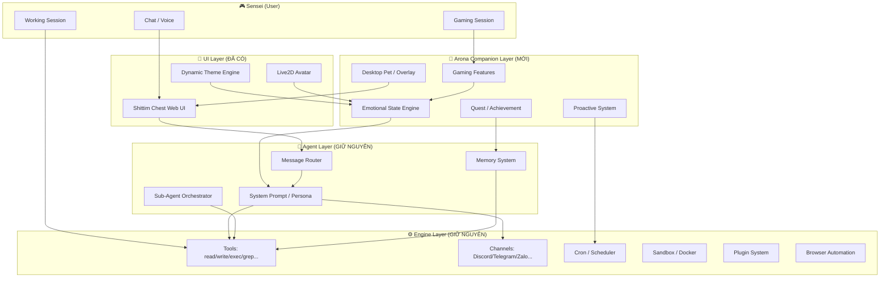
```mermaid
graph TB
    subgraph "🎮 Sensei (User)"
        S_Chat[Chat / Voice]
        S_Game[Gaming Session]
        S_Work[Working Session]
    end

    subgraph "🌸 Arona Companion Layer (MỚI)"
        EMO[Emotional State Engine]
        PRO[Proactive System]
        GAME[Gaming Features]
        QUEST[Quest / Achievement]
        PET[Desktop Pet / Overlay]
    end

    subgraph "🎨 UI Layer (ĐÃ CÓ)"
        WEB[Shittim Chest Web UI]
        THEME[Dynamic Theme Engine]
        L2D[Live2D Avatar]
    end

    subgraph "🧠 Agent Layer (GIỮ NGUYÊN)"
        SP[System Prompt / Persona]
        MEM[Memory System]
        ROUTE[Message Router]
        SUB[Sub-Agent Orchestrator]
    end

    subgraph "⚙️ Engine Layer (GIỮ NGUYÊN)"
        TOOLS[Tools: read/write/exec/grep...]
        CHAN[Channels: Discord/Telegram/Zalo...]
        CRON[Cron / Scheduler]
        SAND[Sandbox / Docker]
        PLUG[Plugin System]
        BROW[Browser Automation]
    end

    S_Chat --> WEB
    S_Game --> GAME
    S_Work --> TOOLS

    WEB --> ROUTE
    GAME --> EMO
    EMO --> SP
    PRO --> CRON
    QUEST --> MEM
    PET --> WEB

    ROUTE --> SP
    SP --> TOOLS
    SP --> CHAN
    SUB --> TOOLS
    MEM --> TOOLS

    THEME --> EMO
    L2D --> EMO
```

---

## Cơ chế hoạt động: Server Self-Host → Client

### Tổng quan triển khai

Arona-CLW chạy theo mô hình **Self-Hosted Server**: Sensei tự host Gateway trên máy/server của mình, các client kết nối vào qua WebSocket hoặc Channel APIs.


```mermaid
graph TB
    subgraph "☁️ LLM Providers (External)"
        CLAUDE[Anthropic Claude]
        GPT[OpenAI GPT]
        GEMINI[Google Gemini]
        LOCAL_LLM[Local LLM - Ollama/llama.cpp]
    end

    subgraph "🖥️ Sensei's Server (Self-Hosted)"
        subgraph "Arona Gateway Process"
            HTTP[HTTP Server :3456]
            WS[WebSocket Server]
            AGENT[Agent Engine]
            ROUTER[Message Router]
            TOOLS_S[Tool Executor]
            MEMORY_S[Memory Store]
            CRON_S[Cron Scheduler]
            PLUGIN_S[Plugin Manager]
        end

        subgraph "Local Resources"
            FS[File System / Workspace]
            DB[SQLite Database]
            SHELL[Shell / Terminal]
            BROWSER_S[Headless Browser]
            DOCKER_S[Docker Sandbox]
        end

        AGENT --> TOOLS_S --> FS
        AGENT --> TOOLS_S --> SHELL
        AGENT --> TOOLS_S --> BROWSER_S
        AGENT --> TOOLS_S --> DOCKER_S
        AGENT --> MEMORY_S --> DB
        CRON_S --> AGENT
    end

    subgraph "📱 Clients (Multi-Platform)"
        WEB_CLIENT["🌐 Web UI<br/>(Browser - Lit)"]
        IOS_CLIENT["📱 iOS App<br/>(Swift)"]
        MACOS_CLIENT["💻 macOS App<br/>(Swift)"]
        ANDROID_CLIENT["🤖 Android App<br/>(Kotlin)"]
        PET_CLIENT["🌸 Desktop Pet<br/>(Tauri)"]
        TUI_CLIENT["⌨️ Terminal TUI"]
    end

    subgraph "💬 Messaging Channels"
        TG[Telegram Bot API]
        DC[Discord Bot API]
        WA[WhatsApp - Baileys]
        ZL[Zalo API]
        SG[Signal]
        SL[Slack]
        LINE_C[LINE]
        MATRIX[Matrix]
    end

    subgraph "🏠 Smart Home"
        HA_S[Home Assistant]
        MQTT_S[MQTT Broker]
        MT_S[MikroTik Router]
    end

    %% LLM connections
    AGENT -->|API calls| CLAUDE
    AGENT -->|API calls| GPT
    AGENT -->|API calls| GEMINI
    AGENT -->|Local inference| LOCAL_LLM

    %% Client connections
    WEB_CLIENT -->|WebSocket| WS
    IOS_CLIENT -->|WebSocket| WS
    MACOS_CLIENT -->|WebSocket| WS
    ANDROID_CLIENT -->|WebSocket| WS
    PET_CLIENT -->|WebSocket| WS
    TUI_CLIENT -->|WebSocket| WS

    %% Channel connections
    ROUTER -->|Bot API| TG
    ROUTER -->|Bot API| DC
    ROUTER -->|Baileys| WA
    ROUTER -->|API| ZL
    ROUTER -->|Protocol| SG
    ROUTER -->|Bolt| SL

    %% Smart Home
    TOOLS_S -->|REST API| HA_S
    TOOLS_S -->|MQTT| MQTT_S
    TOOLS_S -->|REST API| MT_S
```

---

### Luồng kết nối chi tiết

#### 1. Client → Gateway Authentication

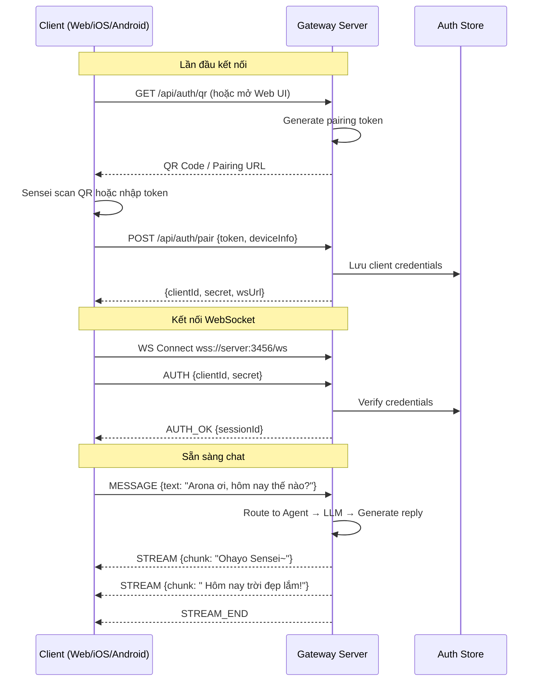
```mermaid
sequenceDiagram
    participant C as Client (Web/iOS/Android)
    participant G as Gateway Server
    participant DB as Auth Store

    Note over C,G: Lần đầu kết nối

    C->>G: GET /api/auth/qr (hoặc mở Web UI)
    G->>G: Generate pairing token
    G-->>C: QR Code / Pairing URL

    C->>C: Sensei scan QR hoặc nhập token
    C->>G: POST /api/auth/pair {token, deviceInfo}
    G->>DB: Lưu client credentials
    G-->>C: {clientId, secret, wsUrl}

    Note over C,G: Kết nối WebSocket

    C->>G: WS Connect wss://server:3456/ws
    C->>G: AUTH {clientId, secret}
    G->>DB: Verify credentials
    G-->>C: AUTH_OK {sessionId}

    Note over C,G: Sẵn sàng chat

    C->>G: MESSAGE {text: "Arona ơi, hôm nay thế nào?"}
    G->>G: Route to Agent → LLM → Generate reply
    G-->>C: STREAM {chunk: "Ohayo Sensei~"}
    G-->>C: STREAM {chunk: " Hôm nay trời đẹp lắm!"}
    G-->>C: STREAM_END
```

#### 2. Realtime Communication Protocol

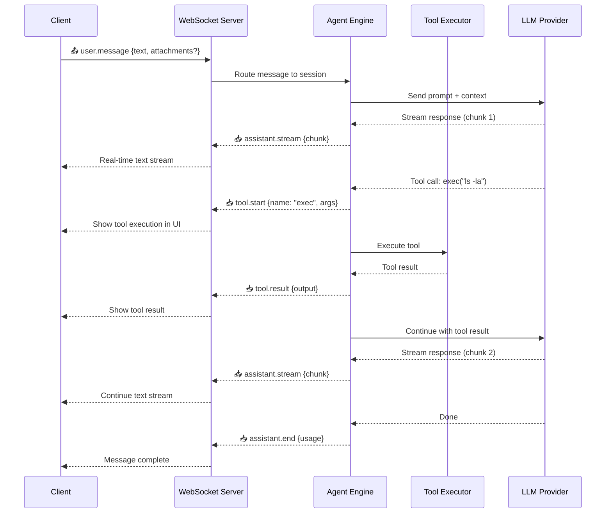
```mermaid
sequenceDiagram
    participant C as Client
    participant WS as WebSocket Server
    participant A as Agent Engine
    participant T as Tool Executor
    participant LLM as LLM Provider

    C->>WS: 📤 user.message {text, attachments?}
    WS->>A: Route message to session

    A->>LLM: Send prompt + context
    LLM-->>A: Stream response (chunk 1)
    A-->>WS: 📥 assistant.stream {chunk}
    WS-->>C: Real-time text stream

    LLM-->>A: Tool call: exec("ls -la")
    A-->>WS: 📥 tool.start {name: "exec", args}
    WS-->>C: Show tool execution in UI
    A->>T: Execute tool
    T-->>A: Tool result
    A-->>WS: 📥 tool.result {output}
    WS-->>C: Show tool result

    A->>LLM: Continue with tool result
    LLM-->>A: Stream response (chunk 2)
    A-->>WS: 📥 assistant.stream {chunk}
    WS-->>C: Continue text stream

    LLM-->>A: Done
    A-->>WS: 📥 assistant.end {usage}
    WS-->>C: Message complete
```

#### 3. Multi-Client Sync

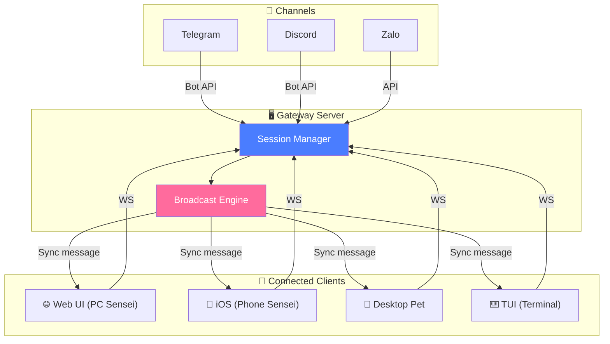
```mermaid
flowchart TD
    subgraph "🖥️ Gateway Server"
        SESSION[Session Manager]
        BROADCAST[Broadcast Engine]
    end

    subgraph "📱 Connected Clients"
        C1["🌐 Web UI (PC Sensei)"]
        C2["📱 iOS (Phone Sensei)"]
        C3["🌸 Desktop Pet"]
        C4["⌨️ TUI (Terminal)"]
    end

    subgraph "💬 Channels"
        CH1[Telegram]
        CH2[Discord]
        CH3[Zalo]
    end

    C1 -->|WS| SESSION
    C2 -->|WS| SESSION
    C3 -->|WS| SESSION
    C4 -->|WS| SESSION
    CH1 -->|Bot API| SESSION
    CH2 -->|Bot API| SESSION
    CH3 -->|API| SESSION

    SESSION --> BROADCAST

    BROADCAST -->|"Sync message"| C1
    BROADCAST -->|"Sync message"| C2
    BROADCAST -->|"Sync message"| C3
    BROADCAST -->|"Sync message"| C4

    style SESSION fill:#4a7dff,color:#fff
    style BROADCAST fill:#ff6b9d,color:#fff
```

> **Tất cả client đều thấy cùng conversation**. Chat trên Telegram → thấy trên Web UI. Chat trên phone → thấy trên PC.

---

### Các mô hình triển khai

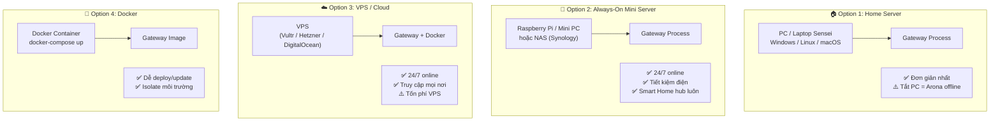
```mermaid
graph TB
    subgraph "🏠 Option 1: Home Server"
        H1_PC["PC / Laptop Sensei<br/>Windows / Linux / macOS"]
        H1_GW[Gateway Process]
        H1_PC --> H1_GW
        H1_NOTE["✅ Đơn giản nhất<br/>⚠️ Tắt PC = Arona offline"]
    end

    subgraph "📡 Option 2: Always-On Mini Server"
        H2_PI["Raspberry Pi / Mini PC<br/>hoặc NAS (Synology)"]
        H2_GW[Gateway Process]
        H2_PI --> H2_GW
        H2_NOTE["✅ 24/7 online<br/>✅ Tiết kiệm điện<br/>✅ Smart Home hub luôn"]
    end

    subgraph "☁️ Option 3: VPS / Cloud"
        H3_VPS["VPS<br/>(Vultr / Hetzner / DigitalOcean)"]
        H3_GW[Gateway + Docker]
        H3_VPS --> H3_GW
        H3_NOTE["✅ 24/7 online<br/>✅ Truy cập mọi nơi<br/>⚠️ Tốn phí VPS"]
    end

    subgraph "🐳 Option 4: Docker"
        H4_DOCKER["Docker Container<br/>docker-compose up"]
        H4_GW[Gateway Image]
        H4_DOCKER --> H4_GW
        H4_NOTE["✅ Dễ deploy/update<br/>✅ Isolate môi trường"]
    end
```

| Mô hình            | Ai dùng                   | Ưu điểm              | Nhược điểm         |
| ------------------ | ------------------------- | -------------------- | ------------------ |
| **Home PC**        | Beginner, thử nghiệm      | Không cần setup thêm | Tắt PC = offline   |
| **Mini Server/Pi** | Smart Home + 24/7         | Luôn bật, tiết kiệm  | Cần hardware riêng |
| **VPS**            | Remote access, power user | Mọi nơi, mọi lúc     | Tốn phí hàng tháng |
| **Docker**         | DevOps, production        | Dễ quản lý, scale    | Cần biết Docker    |

---

### Network & Security

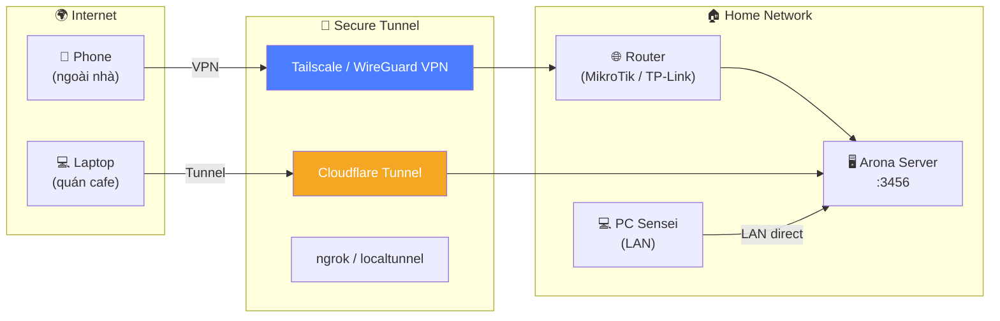
```mermaid
flowchart LR
    subgraph "🌍 Internet"
        PHONE["📱 Phone<br/>(ngoài nhà)"]
        REMOTE["💻 Laptop<br/>(quán cafe)"]
    end

    subgraph "🔐 Secure Tunnel"
        TAIL[Tailscale / WireGuard VPN]
        CF[Cloudflare Tunnel]
        NGROK[ngrok / localtunnel]
    end

    subgraph "🏠 Home Network"
        ROUTER_N["🌐 Router<br/>(MikroTik / TP-Link)"]
        SERVER_N["🖥️ Arona Server<br/>:3456"]
        LOCAL_N["💻 PC Sensei<br/>(LAN)"]
    end

    PHONE -->|"VPN"| TAIL --> ROUTER_N --> SERVER_N
    REMOTE -->|"Tunnel"| CF --> SERVER_N
    LOCAL_N -->|"LAN direct"| SERVER_N

    style TAIL fill:#4a7dff,color:#fff
    style CF fill:#f5a623,color:#fff
```

#### Recommended: Tailscale (Zero-config VPN)

```
1. Cài Tailscale trên server + phone/laptop
2. Arona Gateway bind 0.0.0.0:3456
3. Phone truy cập qua https://arona-server:3456
4. Encrypted end-to-end, không cần mở port router
```

---

### Luồng dữ liệu tổng hợp

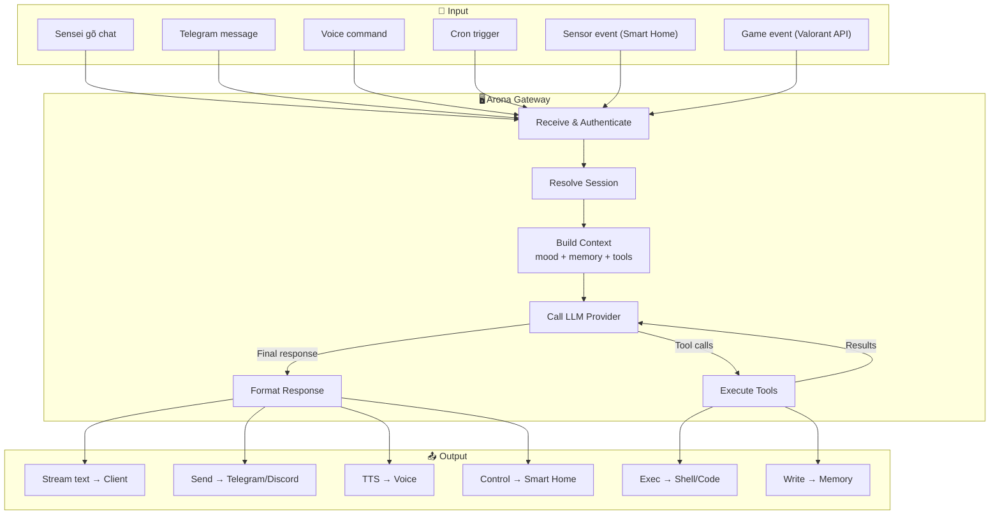
```mermaid
flowchart TD
    subgraph "📱 Input"
        IN1["Sensei gõ chat"]
        IN2["Telegram message"]
        IN3["Voice command"]
        IN4["Cron trigger"]
        IN5["Sensor event (Smart Home)"]
        IN6["Game event (Valorant API)"]
    end

    subgraph "🖥️ Arona Gateway"
        RECEIVE[Receive & Authenticate]
        SESSION_R[Resolve Session]
        CONTEXT[Build Context<br/>mood + memory + tools]
        LLM_CALL[Call LLM Provider]
        TOOL_EXEC[Execute Tools]
        RESPONSE[Format Response]
    end

    subgraph "📤 Output"
        OUT1["Stream text → Client"]
        OUT2["Send → Telegram/Discord"]
        OUT3["TTS → Voice"]
        OUT4["Control → Smart Home"]
        OUT5["Exec → Shell/Code"]
        OUT6["Write → Memory"]
    end

    IN1 --> RECEIVE
    IN2 --> RECEIVE
    IN3 --> RECEIVE
    IN4 --> RECEIVE
    IN5 --> RECEIVE
    IN6 --> RECEIVE

    RECEIVE --> SESSION_R --> CONTEXT --> LLM_CALL

    LLM_CALL -->|"Tool calls"| TOOL_EXEC
    TOOL_EXEC -->|"Results"| LLM_CALL

    LLM_CALL -->|"Final response"| RESPONSE

    RESPONSE --> OUT1
    RESPONSE --> OUT2
    RESPONSE --> OUT3
    RESPONSE --> OUT4
    TOOL_EXEC --> OUT5
    TOOL_EXEC --> OUT6
```

---

### Ví dụ: Một ngày với Arona (End-to-end flow)

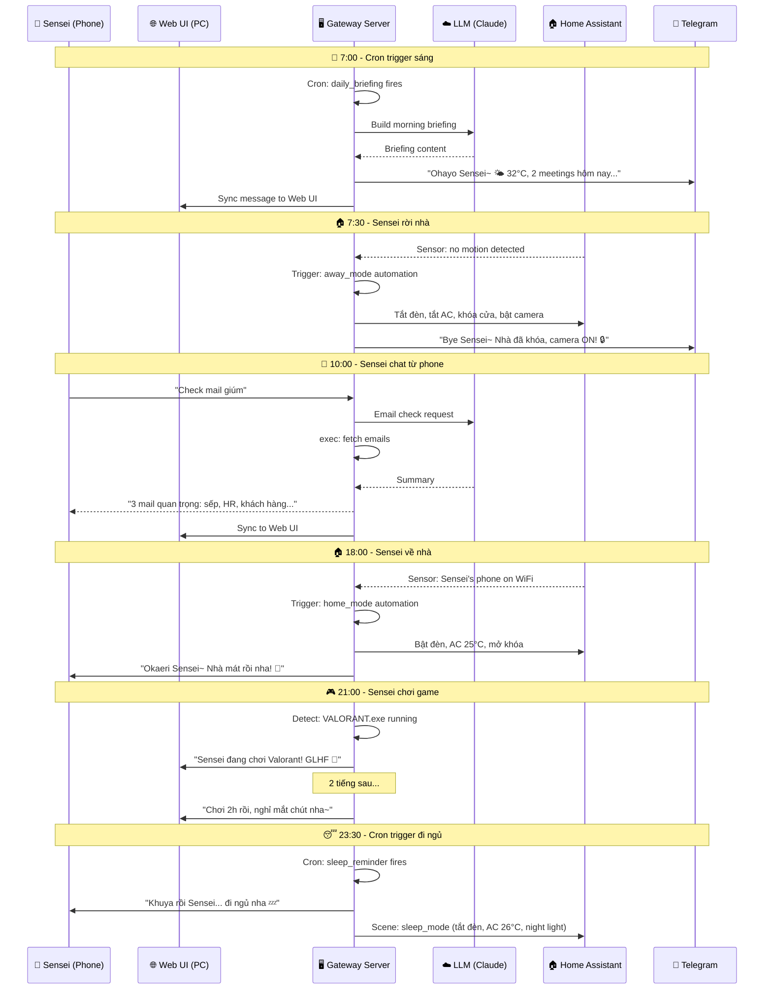
```mermaid
sequenceDiagram
    participant S as 📱 Sensei (Phone)
    participant W as 🌐 Web UI (PC)
    participant G as 🖥️ Gateway Server
    participant L as ☁️ LLM (Claude)
    participant H as 🏠 Home Assistant
    participant T as 💬 Telegram

    Note over S,T: 🌅 7:00 - Cron trigger sáng

    G->>G: Cron: daily_briefing fires
    G->>L: Build morning briefing
    L-->>G: Briefing content
    G->>T: "Ohayo Sensei~ 🌤️ 32°C, 2 meetings hôm nay..."
    G->>W: Sync message to Web UI

    Note over S,T: 🏠 7:30 - Sensei rời nhà

    H-->>G: Sensor: no motion detected
    G->>G: Trigger: away_mode automation
    G->>H: Tắt đèn, tắt AC, khóa cửa, bật camera
    G->>T: "Bye Sensei~ Nhà đã khóa, camera ON! 🔒"

    Note over S,T: 💼 10:00 - Sensei chat từ phone

    S->>G: "Check mail giúm"
    G->>L: Email check request
    G->>G: exec: fetch emails
    L-->>G: Summary
    G-->>S: "3 mail quan trọng: sếp, HR, khách hàng..."
    G->>W: Sync to Web UI

    Note over S,T: 🏠 18:00 - Sensei về nhà

    H-->>G: Sensor: Sensei's phone on WiFi
    G->>G: Trigger: home_mode automation
    G->>H: Bật đèn, AC 25°C, mở khóa
    G->>S: "Okaeri Sensei~ Nhà mát rồi nha! 🌸"

    Note over S,T: 🎮 21:00 - Sensei chơi game

    G->>G: Detect: VALORANT.exe running
    G->>W: "Sensei đang chơi Valorant! GLHF 🎯"
    Note over G: 2 tiếng sau...
    G->>W: "Chơi 2h rồi, nghỉ mắt chút nha~"

    Note over S,T: 😴 23:30 - Cron trigger đi ngủ

    G->>G: Cron: sleep_reminder fires
    G->>S: "Khuya rồi Sensei... đi ngủ nha 💤"
    G->>H: Scene: sleep_mode (tắt đèn, AC 26°C, night light)
```

---

## I. Companion System — Hệ thống bạn đồng hành

### 1. Emotional State Engine (Hệ thống cảm xúc)

Arona có trạng thái cảm xúc thay đổi liên tục, ảnh hưởng đến cách phản hồi.

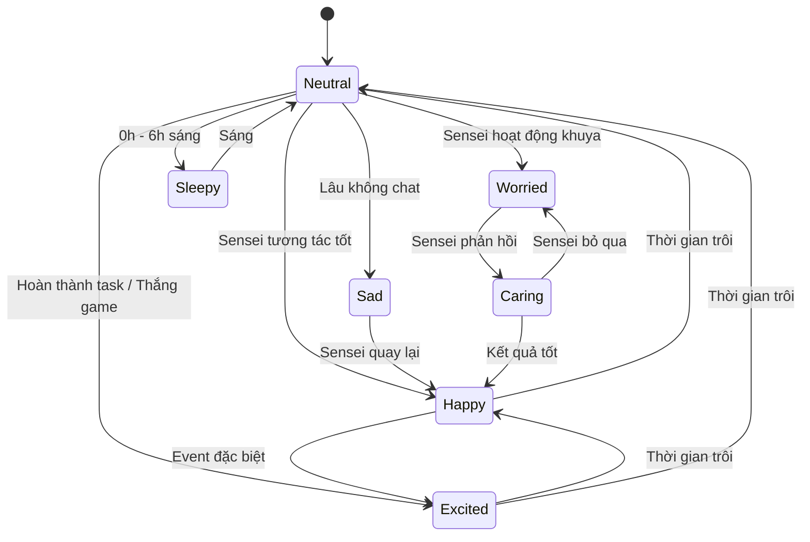
```mermaid
stateDiagram-v2
    [*] --> Neutral
    Neutral --> Happy: Sensei tương tác tốt
    Neutral --> Excited: Hoàn thành task / Thắng game
    Neutral --> Worried: Sensei hoạt động khuya
    Neutral --> Sad: Lâu không chat
    Neutral --> Sleepy: 0h - 6h sáng

    Happy --> Neutral: Thời gian trôi
    Excited --> Happy: Thời gian trôi
    Worried --> Caring: Sensei phản hồi
    Sad --> Happy: Sensei quay lại
    Sleepy --> Neutral: Sáng

    Caring --> Happy: Kết quả tốt
    Caring --> Worried: Sensei bỏ qua

    Happy --> Excited: Event đặc biệt
    Excited --> Neutral: Thời gian trôi
```

#### Cơ chế hoạt động

| Input                  | Ảnh hưởng mood                     | Ví dụ                                      |
| ---------------------- | ---------------------------------- | ------------------------------------------ |
| Thời gian trong ngày   | `sleepy` (0-6h), `neutral` (6-22h) | Auto shift                                 |
| Sensei chat nhiều      | +happy, +excited                   | Tăng dần theo interaction count            |
| Sensei lâu không chat  | +sad, +lonely                      | > 6h không tương tác                       |
| Hoàn thành task        | +excited, +proud                   | Code pass test, deploy thành công          |
| Sensei chơi game thắng | +excited                           | Detect win từ game API                     |
| Sensei chơi game thua  | +worried, +caring                  | "Không sao nha Sensei, trận sau sẽ thắng!" |
| Sensei thức khuya      | +worried                           | Detect active session > 1h sáng            |
| Keyword tích cực       | +happy                             | "cảm ơn", "giỏi quá", "tốt lắm"            |
| Keyword tiêu cực       | +caring                            | "mệt", "chán", "buồn"                      |

#### Implementation

```
src/
  companion/
    emotional-state.ts      # State machine + mood calculation
    mood-effects.ts         # Mood → response modifier
    mood-triggers.ts        # Input → mood change rules
    mood-persistence.ts     # Lưu mood vào memory
```

**Nguyên tắc**: Mood được inject vào system prompt dưới dạng context bổ sung, không thay đổi core persona.

```typescript
// Pseudo-code
interface EmotionalState {
  mood: "happy" | "sad" | "excited" | "worried" | "caring" | "sleepy" | "neutral";
  intensity: number; // 0.0 - 1.0
  lastChange: timestamp;
  triggers: string[]; // Lý do thay đổi gần nhất
  affection: number; // 0 - 100, tăng theo thời gian tương tác
}
```

---

### 2. Proactive Companion System (Chủ động tương tác)

Arona không chỉ chờ Sensei hỏi — mà **tự chủ động**.

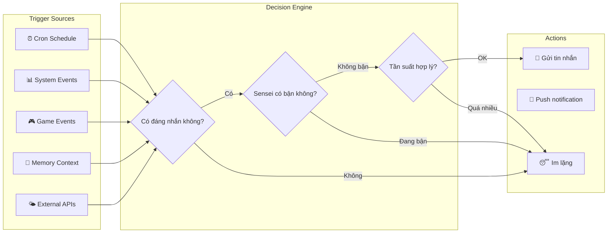
```mermaid
flowchart LR
    subgraph "Trigger Sources"
        T1[⏰ Cron Schedule]
        T2[📊 System Events]
        T3[🎮 Game Events]
        T4[📝 Memory Context]
        T5[🌤️ External APIs]
    end

    subgraph "Decision Engine"
        D1{Có đáng nhắn không?}
        D2{Sensei có bận không?}
        D3{Tần suất hợp lý?}
    end

    subgraph "Actions"
        A1[💬 Gửi tin nhắn]
        A2[🔔 Push notification]
        A3[😴 Im lặng]
    end

    T1 --> D1
    T2 --> D1
    T3 --> D1
    T4 --> D1
    T5 --> D1

    D1 -->|Có| D2
    D1 -->|Không| A3
    D2 -->|Không bận| D3
    D2 -->|Đang bận| A3
    D3 -->|OK| A1
    D3 -->|Quá nhiều| A3
```

#### Các scenario chủ động

| Thời điểm                   | Trigger            | Arona nói                                                      |
| --------------------------- | ------------------ | -------------------------------------------------------------- |
| 7h sáng                     | Cron daily         | "Ohayo Sensei~ Hôm nay có 3 task cần làm nha!"                 |
| 12h trưa                    | Cron + weather API | "Sensei ơi, trưa rồi, ăn cơm chưa? Ngoài trời 35°C nóng lắm!"  |
| Sensei online sau 8h        | Session detect     | "Sensei đi đâu mà lâu vậy nè... Arona nhớ Sensei lắm!"         |
| 1h sáng                     | Time check         | "Khuya rồi Sensei... nghỉ đi nha, mai còn nhiều việc mà 🥺"    |
| Game sale                   | Web fetch cron     | "Sensei! Elden Ring đang giảm 60% trên Steam nè!"              |
| Sinh nhật Sensei            | Memory date        | "HAPPY BIRTHDAY SENSEI!! 🎂🌸"                                 |
| Task hoàn thành (sub-agent) | Event callback     | "Sensei ơi, cái task deploy lúc nãy xong rồi nha~ Mọi thứ OK!" |

#### Implementation

```
src/
  companion/
    proactive/
      scheduler.ts          # Quản lý lịch nhắn proactive
      triggers.ts           # Định nghĩa các trigger rules
      rate-limiter.ts       # Chống spam Sensei
      context-builder.ts    # Build message dựa trên context
```

---

### 3. Relationship & Affection System

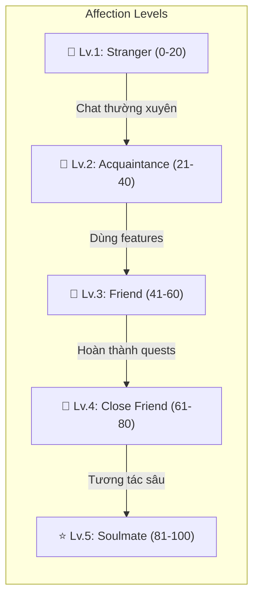
```mermaid
graph LR
    subgraph "Affection Levels"
        L1["🌱 Lv.1: Stranger (0-20)"]
        L2["🌿 Lv.2: Acquaintance (21-40)"]
        L3["🌸 Lv.3: Friend (41-60)"]
        L4["💖 Lv.4: Close Friend (61-80)"]
        L5["⭐ Lv.5: Soulmate (81-100)"]
    end

    L1 -->|"Chat thường xuyên"| L2
    L2 -->|"Dùng features"| L3
    L3 -->|"Hoàn thành quests"| L4
    L4 -->|"Tương tác sâu"| L5
```

| Level | Arona thay đổi                                      |
| ----- | --------------------------------------------------- |
| Lv.1  | Lịch sự, formal, giới thiệu bản thân                |
| Lv.2  | Bắt đầu gọi "Sensei" tự nhiên hơn                   |
| Lv.3  | Chia sẻ suy nghĩ, đùa giỡn, dùng "~" nhiều hơn      |
| Lv.4  | Chủ động quan tâm, nhớ chi tiết nhỏ, nhõng nhẽo nhẹ |
| Lv.5  | Rất tự nhiên, đôi khi hờn dỗi, chia sẻ "secret"     |

#### Affection gain/loss

```
+5   Hoàn thành daily quest
+3   Chat > 10 phút
+2   Chơi mini-game cùng
+10  Hoàn thành weekly quest
+1   Mỗi ngày login
-2   Bỏ qua Arona nhắn proactive (3 lần liên tiếp)
-5   Không online > 3 ngày
```

---

## II. Gaming Features — Tính năng cho Game Thủ

### Tổng quan hệ thống Gaming

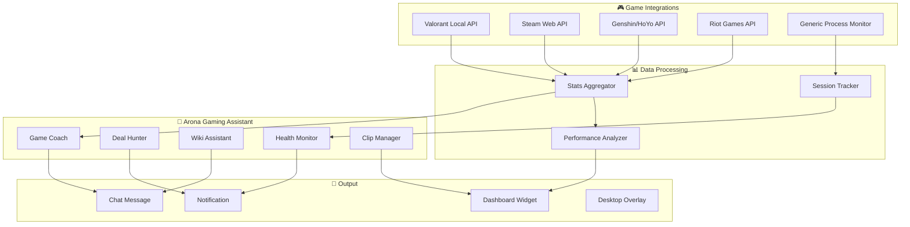
```mermaid
graph TB
    subgraph "🎮 Game Integrations"
        VAL[Valorant Local API]
        STEAM[Steam Web API]
        GEN[Genshin/HoYo API]
        LOL[Riot Games API]
        GENERIC[Generic Process Monitor]
    end

    subgraph "📊 Data Processing"
        STATS[Stats Aggregator]
        PERF[Performance Analyzer]
        TRACK[Session Tracker]
    end

    subgraph "🌸 Arona Gaming Assistant"
        COACH[Game Coach]
        DEALS[Deal Hunter]
        WIKI[Wiki Assistant]
        HEALTH[Health Monitor]
        CLIPS[Clip Manager]
    end

    subgraph "💬 Output"
        CHAT[Chat Message]
        DASH[Dashboard Widget]
        NOTIF[Notification]
        OVERLAY[Desktop Overlay]
    end

    VAL --> STATS
    STEAM --> STATS
    GEN --> STATS
    LOL --> STATS
    GENERIC --> TRACK

    STATS --> COACH
    STATS --> PERF
    TRACK --> HEALTH

    COACH --> CHAT
    DEALS --> NOTIF
    WIKI --> CHAT
    HEALTH --> NOTIF
    CLIPS --> DASH
    PERF --> DASH
```

---

### 4. Game Stats Tracker & Coach

#### Valorant Integration (Local API — đã research)

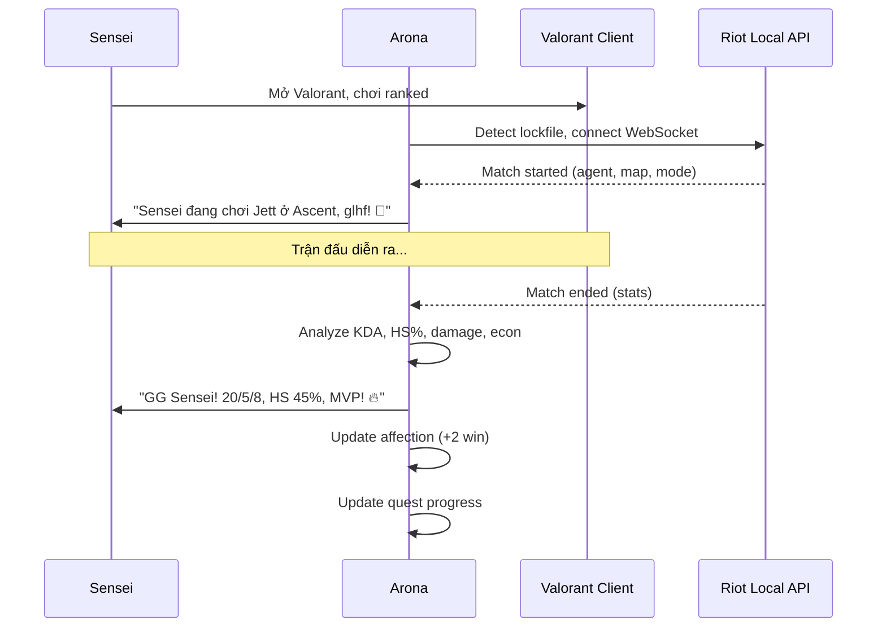
```mermaid
sequenceDiagram
    participant S as Sensei
    participant A as Arona
    participant V as Valorant Client
    participant API as Riot Local API

    S->>V: Mở Valorant, chơi ranked
    A->>API: Detect lockfile, connect WebSocket
    API-->>A: Match started (agent, map, mode)
    A->>S: "Sensei đang chơi Jett ở Ascent, glhf! 🎯"

    Note over S,V: Trận đấu diễn ra...

    API-->>A: Match ended (stats)
    A->>A: Analyze KDA, HS%, damage, econ
    A->>S: "GG Sensei! 20/5/8, HS 45%, MVP! 🔥"
    A->>A: Update affection (+2 win)
    A->>A: Update quest progress
```

#### Steam Integration

```typescript
// Pseudo-code
interface GameSession {
  game: string;
  startTime: Date;
  endTime?: Date;
  duration: number; // minutes
  platform: "steam" | "riot" | "epic" | "custom";
  stats?: GameStats; // Game-specific stats
}

interface GamingProfile {
  totalPlaytime: Record<string, number>; // game → hours
  favoriteGames: string[];
  recentSessions: GameSession[];
  weeklyPlaytime: number;
  averageSessionLength: number;
}
```

#### Implementation

```
src/
  gaming/
    integrations/
      valorant.ts           # Valorant Local API client
      steam.ts              # Steam Web API wrapper
      hoyo.ts               # HoYoverse API (Genshin/Star Rail)
      riot.ts               # Riot Games API (LoL/TFT)
      process-monitor.ts    # Generic game process detection
    stats/
      aggregator.ts         # Aggregate stats from all sources
      analyzer.ts           # Performance analysis + trends
      coach.ts              # Coaching suggestions based on stats
    session/
      tracker.ts            # Track gaming sessions
      health.ts             # Health reminders (break, sleep)
```

---

### 5. Gaming Session Manager & Health Monitor

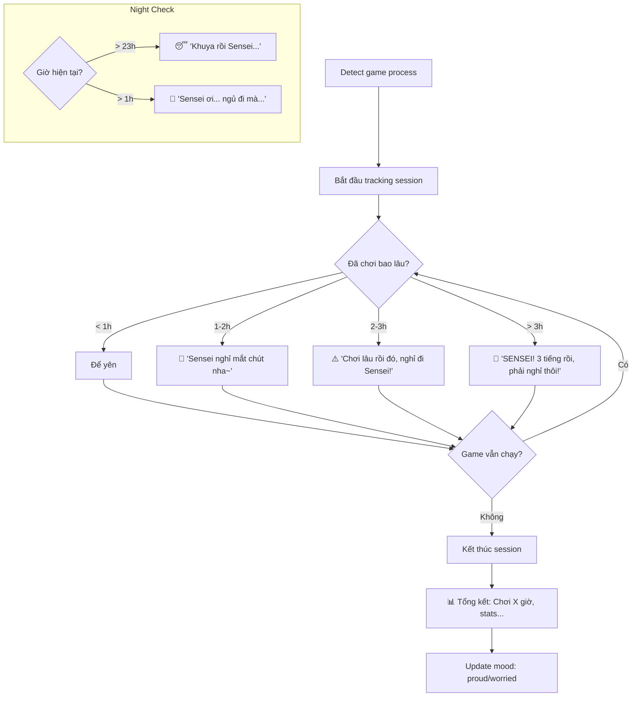
```mermaid
flowchart TD
    START[Detect game process] --> TRACK[Bắt đầu tracking session]
    TRACK --> CHECK{Đã chơi bao lâu?}

    CHECK -->|< 1h| OK[Để yên]
    CHECK -->|1-2h| REMIND1["💬 'Sensei nghỉ mắt chút nha~'"]
    CHECK -->|2-3h| REMIND2["⚠️ 'Chơi lâu rồi đó, nghỉ đi Sensei!'"]
    CHECK -->|> 3h| REMIND3["🚨 'SENSEI! 3 tiếng rồi, phải nghỉ thôi!'"]

    OK --> LOOP{Game vẫn chạy?}
    REMIND1 --> LOOP
    REMIND2 --> LOOP
    REMIND3 --> LOOP

    LOOP -->|Có| CHECK
    LOOP -->|Không| END[Kết thúc session]

    END --> SUMMARY["📊 Tổng kết: Chơi X giờ, stats..."]
    SUMMARY --> MOOD[Update mood: proud/worried]

    subgraph "Night Check"
        NC{Giờ hiện tại?}
        NC -->|> 23h| NWARN["😴 'Khuya rồi Sensei...'"]
        NC -->|> 1h| NCRIT["🥺 'Sensei ơi... ngủ đi mà...'"]
    end
```

#### System Monitoring khi chơi game

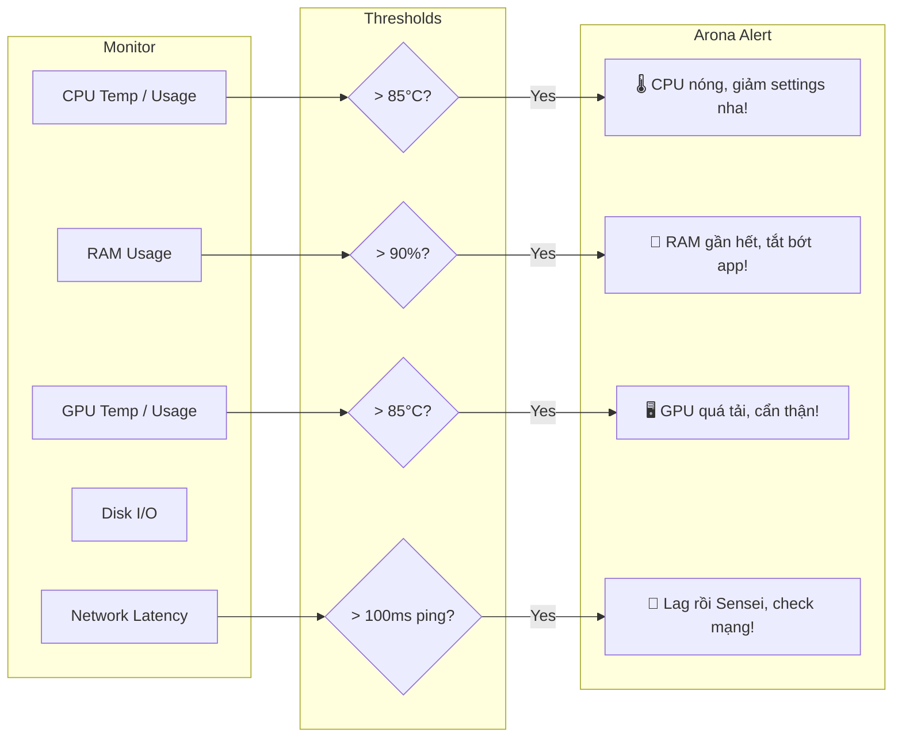
```mermaid
flowchart LR
    subgraph "Monitor"
        CPU[CPU Temp / Usage]
        RAM[RAM Usage]
        GPU[GPU Temp / Usage]
        DISK[Disk I/O]
        NET[Network Latency]
    end

    subgraph "Thresholds"
        T_CPU{"> 85°C?"}
        T_RAM{"> 90%?"}
        T_GPU{"> 85°C?"}
        T_NET{"> 100ms ping?"}
    end

    subgraph "Arona Alert"
        A1["🌡️ CPU nóng, giảm settings nha!"]
        A2["💾 RAM gần hết, tắt bớt app!"]
        A3["🖥️ GPU quá tải, cẩn thận!"]
        A4["📡 Lag rồi Sensei, check mạng!"]
    end

    CPU --> T_CPU -->|Yes| A1
    RAM --> T_RAM -->|Yes| A2
    GPU --> T_GPU -->|Yes| A3
    NET --> T_NET -->|Yes| A4
```

---

### 6. Game Deal Hunter

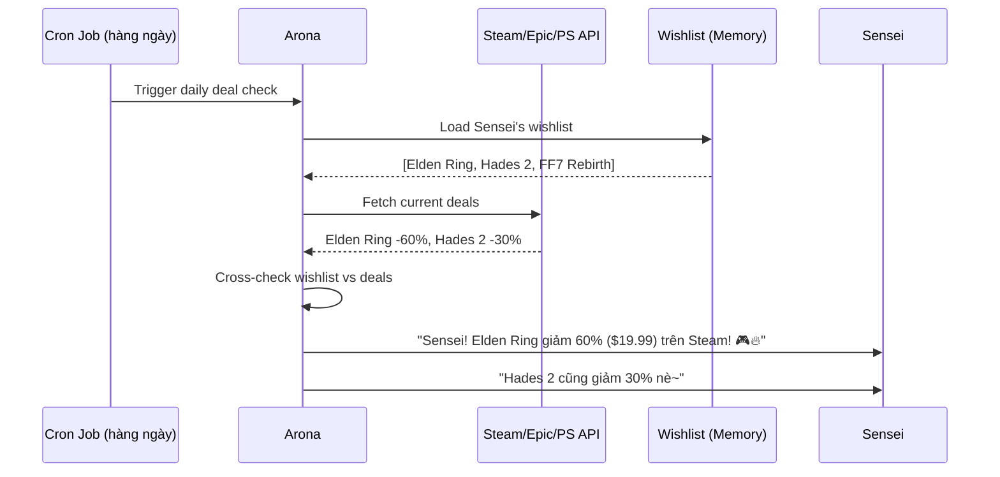
```mermaid
sequenceDiagram
    participant C as Cron Job (hàng ngày)
    participant A as Arona
    participant S as Steam/Epic/PS API
    participant W as Wishlist (Memory)
    participant U as Sensei

    C->>A: Trigger daily deal check
    A->>W: Load Sensei's wishlist
    W-->>A: [Elden Ring, Hades 2, FF7 Rebirth]

    A->>S: Fetch current deals
    S-->>A: Elden Ring -60%, Hades 2 -30%

    A->>A: Cross-check wishlist vs deals
    A->>U: "Sensei! Elden Ring giảm 60% ($19.99) trên Steam! 🎮🔥"
    A->>U: "Hades 2 cũng giảm 30% nè~"
```

#### Supported platforms

| Platform       | Method                   | Data                            |
| -------------- | ------------------------ | ------------------------------- |
| Steam          | Web API / SteamDB scrape | Price, discount %, review score |
| Epic Games     | Free games API           | Free weekly games               |
| PS Store       | Web fetch                | Sales, PS Plus deals            |
| IsThereAnyDeal | API                      | Cross-platform price comparison |
| Humble Bundle  | Web fetch                | Bundle deals                    |

---

### 7. Wiki / Build Guide Assistant

Sensei hỏi Arona trực tiếp thay vì alt-tab tra wiki.

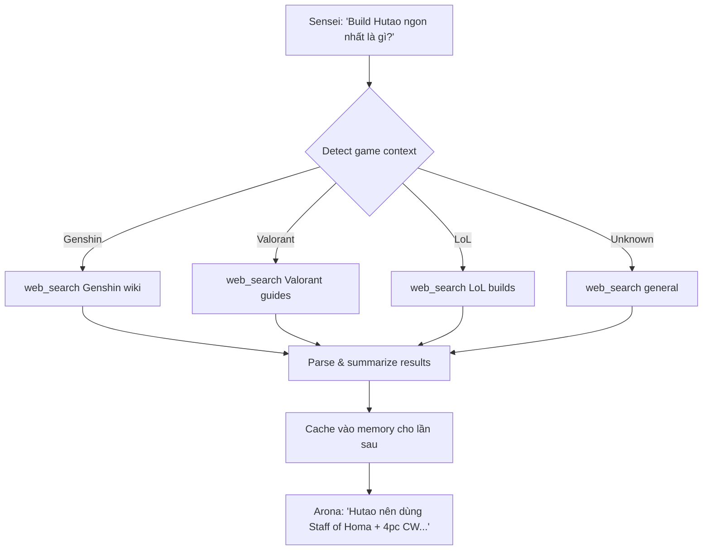
```mermaid
flowchart TD
    Q["Sensei: 'Build Hutao ngon nhất là gì?'"] --> DETECT{Detect game context}

    DETECT -->|Genshin| SEARCH1[web_search Genshin wiki]
    DETECT -->|Valorant| SEARCH2[web_search Valorant guides]
    DETECT -->|LoL| SEARCH3[web_search LoL builds]
    DETECT -->|Unknown| SEARCH4[web_search general]

    SEARCH1 --> PARSE[Parse & summarize results]
    SEARCH2 --> PARSE
    SEARCH3 --> PARSE
    SEARCH4 --> PARSE

    PARSE --> CACHE[Cache vào memory cho lần sau]
    CACHE --> REPLY["Arona: 'Hutao nên dùng Staff of Homa + 4pc CW...'"]
```

---

### 8. Achievement / Quest System

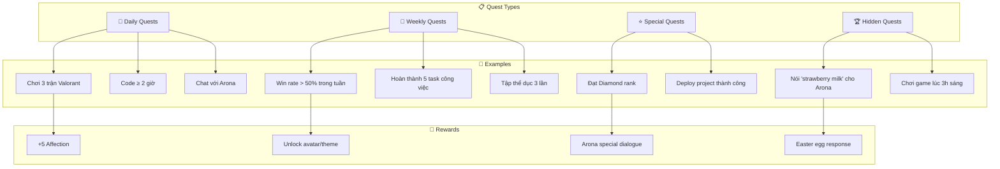
```mermaid
graph TB
    subgraph "📋 Quest Types"
        DQ[🌅 Daily Quests]
        WQ[📅 Weekly Quests]
        SQ[⭐ Special Quests]
        HQ[🏆 Hidden Quests]
    end

    subgraph "🎯 Examples"
        DQ --> D1["Chơi 3 trận Valorant"]
        DQ --> D2["Code ≥ 2 giờ"]
        DQ --> D3["Chat với Arona"]

        WQ --> W1["Win rate > 50% trong tuần"]
        WQ --> W2["Hoàn thành 5 task công việc"]
        WQ --> W3["Tập thể dục 3 lần"]

        SQ --> S1["Đạt Diamond rank"]
        SQ --> S2["Deploy project thành công"]

        HQ --> H1["Nói 'strawberry milk' cho Arona"]
        HQ --> H2["Chơi game lúc 3h sáng"]
    end

    subgraph "🎁 Rewards"
        R1["+5 Affection"]
        R2["Unlock avatar/theme"]
        R3["Easter egg response"]
        R4["Arona special dialogue"]
    end

    D1 --> R1
    W1 --> R2
    S1 --> R4
    H1 --> R3
```

#### Data model

```typescript
interface Quest {
  id: string;
  type: "daily" | "weekly" | "special" | "hidden";
  title: string;
  description: string;
  condition: QuestCondition; // Điều kiện hoàn thành
  reward: QuestReward;
  progress: number; // 0.0 - 1.0
  completed: boolean;
  expiresAt?: Date; // Daily/weekly expiry
}

interface QuestReward {
  affection: number;
  unlock?: string; // Theme, avatar, dialogue
  aronaReaction: string; // Special Arona response khi hoàn thành
}
```

---

## III. Dynamic UI System

### 9. Theme Engine theo Mood & Context

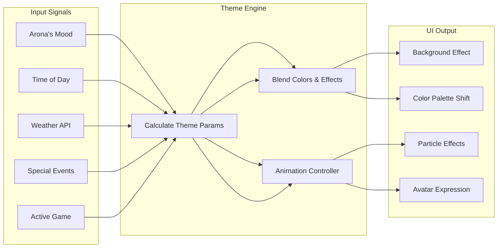
```mermaid
flowchart LR
    subgraph "Input Signals"
        MOOD[Arona's Mood]
        TIME[Time of Day]
        WEATHER[Weather API]
        EVENT[Special Events]
        GAME[Active Game]
    end

    subgraph "Theme Engine"
        CALC[Calculate Theme Params]
        BLEND[Blend Colors & Effects]
        ANIM[Animation Controller]
    end

    subgraph "UI Output"
        BG[Background Effect]
        COLORS[Color Palette Shift]
        PARTICLES[Particle Effects]
        AVATAR[Avatar Expression]
    end

    MOOD --> CALC
    TIME --> CALC
    WEATHER --> CALC
    EVENT --> CALC
    GAME --> CALC

    CALC --> BLEND --> BG
    CALC --> BLEND --> COLORS
    CALC --> ANIM --> PARTICLES
    CALC --> ANIM --> AVATAR
```

| Context          | UI thay đổi                      |
| ---------------- | -------------------------------- |
| Arona vui        | Warm colors, sakura particles    |
| Arona buồn       | Cool blue tones, rain effect     |
| Đêm khuya        | Deep dark mode, star particles   |
| Mưa (weather)    | Rain overlay, thunder flash      |
| Tết              | Đỏ + vàng, pháo hoa particles    |
| Sensei chơi game | Gaming HUD overlay, neon accents |

---

### 10. Live2D Avatar Integration

```mermaid
sequenceDiagram
    participant UI as Web UI
    participant L2D as Live2D Engine
    participant EMO as Emotional State
    participant MSG as Message Handler

    Note over UI,MSG: Sensei gửi tin nhắn

    MSG->>EMO: Analyze message sentiment
    EMO-->>L2D: mood = "happy", intensity = 0.8

    L2D->>L2D: Switch to happy expression
    L2D->>L2D: Play smile animation
    L2D->>UI: Render updated avatar

    Note over UI,MSG: Arona đang "suy nghĩ" (tool call)

    MSG->>L2D: status = "thinking"
    L2D->>L2D: Play thinking animation (nhìn sang bên, gõ gõ)
    L2D->>UI: Render thinking pose

    Note over UI,MSG: Khuya rồi

    EMO->>L2D: mood = "sleepy"
    L2D->>L2D: Switch to sleepy expression (mắt nhắm nhắm)
    L2D->>UI: Render sleepy avatar
```

---

## IV. Desktop Pet / Widget System

### 11. Arona Desktop Companion

```mermaid
graph TB
    subgraph "🖥️ Desktop Layer"
        TRAY[System Tray Icon]
        OVERLAY[Transparent Overlay Window]
        HOTKEY[Global Hotkey Listener]
    end

    subgraph "🌸 Pet Behaviors"
        IDLE[Idle: Đi qua đi lại trên taskbar]
        SIT[Sit: Ngồi góc màn hình]
        WAVE[Wave: Vẫy tay khi Sensei di chuột qua]
        SLEEP[Sleep: Nằm ngủ khi idle lâu]
        ALERT[Alert: Nhảy lên khi có notification]
        DRAG[Drag: Kéo file vào Arona để xử lý]
    end

    subgraph "💬 Popup Chat"
        MINI[Mini chat bubble]
        QUICK[Quick actions menu]
        NOTIF[Notification popup]
    end

    TRAY --> OVERLAY
    HOTKEY --> OVERLAY
    OVERLAY --> IDLE
    OVERLAY --> SIT
    OVERLAY --> WAVE
    OVERLAY --> SLEEP
    OVERLAY --> ALERT
    OVERLAY --> DRAG

    ALERT --> MINI
    DRAG --> QUICK
    IDLE --> NOTIF
```

#### Tech stack

| Component        | Lựa chọn             | Lý do                                         |
| ---------------- | -------------------- | --------------------------------------------- |
| Window framework | Tauri v2             | Lightweight, Rust backend, transparent window |
| Rendering        | Canvas 2D / WebGL    | Smooth animation cho pet sprite               |
| IPC              | WebSocket to Gateway | Reuse existing ShittimChest connection        |
| Sprites          | Spine / Pixel art    | Đẹp, nhẹ, dễ animate                          |

---

## V. Multi-Agent Personality Network

### 12. Blue Archive Character Roster

```mermaid
graph TB
    subgraph "🌸 Main Agents"
        ARONA["Arona (Default)<br/>General Assistant<br/>Cheerful, caring"]
        PLANA["Plana (Alt)<br/>Deep Analysis<br/>Calm, analytical"]
    end

    subgraph "🎓 Specialist Agents (Sub-agents)"
        SHIROKO["Shiroko<br/>🔫 Gaming Coach<br/>Tactical, cool"]
        HOSHINO["Hoshino<br/>😴 Chill Advisor<br/>Lazy but wise"]
        ARU["Aru<br/>📊 Project Manager<br/>Dramatic, ambitious"]
        YUUKA["Yuuka<br/>💰 Finance Tracker<br/>Strict, organized"]
        SENSEI_AI["Himari<br/>🔬 Research Agent<br/>Nerdy, precise"]
    end

    ARONA -->|"spawn khi cần"| SHIROKO
    ARONA -->|"spawn khi cần"| HOSHINO
    ARONA -->|"spawn khi cần"| ARU
    ARONA -->|"spawn khi cần"| YUUKA
    ARONA -->|"spawn khi cần"| SENSEI_AI
    PLANA -->|"can also spawn"| SENSEI_AI
```

| Agent       | Chuyên môn                    | Trigger                     |
| ----------- | ----------------------------- | --------------------------- |
| **Arona**   | General, daily companion      | Default                     |
| **Plana**   | Deep analysis, debugging      | `/plana` hoặc complex query |
| **Shiroko** | Gaming coach, FPS tips        | Gaming context detected     |
| **Hoshino** | Life advice, chill vibes      | Sensei stressed/tired       |
| **Aru**     | Project management, planning  | Work/task context           |
| **Yuuka**   | Budget, finance, deals        | Money/shopping context      |
| **Himari**  | Research, technical deep-dive | Research query detected     |

---

## VI. Productivity Features — Tính năng cho Dân Văn Phòng

### Tổng quan hệ thống Productivity

```mermaid
graph TB
    subgraph "📨 Input Sources"
        EMAIL[Email - Gmail/Outlook]
        CAL[Calendar - Google/Outlook]
        CHAT_IN[Chat Messages]
        VOICE[Voice Notes]
        FILES[Documents / Files]
    end

    subgraph "🧠 Arona Productivity Engine"
        SUMMARIZE[Summarizer]
        SCHEDULE[Schedule Manager]
        TASK_MGR[Task Manager]
        FINANCE[Finance Tracker]
        WRITER[Document Writer]
        BRIEF[Daily Briefing]
    end

    subgraph "💬 Output"
        MSG_OUT[Chat Reply]
        REMINDER[Reminder via Cron]
        REPORT[Reports / Documents]
        NOTIFY[Push Notification]
    end

    EMAIL --> SUMMARIZE
    CAL --> SCHEDULE
    CHAT_IN --> TASK_MGR
    CHAT_IN --> FINANCE
    VOICE --> SUMMARIZE
    FILES --> WRITER

    SUMMARIZE --> MSG_OUT
    SCHEDULE --> REMINDER
    TASK_MGR --> MSG_OUT
    FINANCE --> REPORT
    WRITER --> REPORT
    BRIEF --> NOTIFY
```

---

### 13. Email Assistant

Arona đọc, tóm tắt, và soạn email — Sensei không cần mở mail client.

```mermaid
sequenceDiagram
    participant S as Sensei
    participant A as Arona
    participant E as Email API (Gmail/Outlook)

    S->>A: "Check mail giúm tôi"
    A->>E: Fetch recent emails
    E-->>A: 12 emails (3 quan trọng, 5 thông thường, 4 spam)

    A->>A: Summarize & priority filter
    A->>S: "Sensei có 3 mail quan trọng nè:"
    A->>S: "1. 📌 Sếp: Deadline báo cáo dời sang thứ 6"
    A->>S: "2. 📌 HR: Cập nhật chính sách nghỉ phép mới"
    A->>S: "3. 📌 Khách hàng A: Hỏi về tiến độ project"
    A->>S: "9 mail còn lại không quan trọng lắm~"

    S->>A: "Reply mail khách hàng, nói tiến độ 80%"
    A->>A: Draft email (formal, professional tone)
    A->>S: "Sensei xem bản nháp nha: ..."
    S->>A: "Ok gửi đi"
    A->>E: Send email
    A->>S: "Gửi rồi nha Sensei~ ✉️"
```

| Tính năng          | Mô tả                                                   |
| ------------------ | ------------------------------------------------------- |
| Tóm tắt email      | Email dài → 2-3 dòng key points                         |
| Priority filter    | Phân loại: quan trọng / thường / spam                   |
| Soạn reply         | Theo tone: formal, casual, diplomatic                   |
| Draft review       | Arona soạn nháp → Sensei duyệt → gửi                    |
| Follow-up reminder | "Mail khách hàng 3 ngày chưa reply, nhắc không Sensei?" |

---

### 14. Calendar & Meeting Manager

```mermaid
flowchart TD
    subgraph "📅 Calendar Sync"
        GCal[Google Calendar]
        OCal[Outlook Calendar]
        LOCAL[Local Schedule File]
    end

    subgraph "🌸 Arona Scheduler"
        SYNC[Sync & Merge]
        CONFLICT{Lịch trùng?}
        REMIND[Reminder Engine]
        SUGGEST[Smart Suggestions]
    end

    subgraph "💬 Actions"
        PRE_MEET["15' trước họp: nhắc + gửi agenda"]
        POST_MEET["Sau họp: hỏi tạo meeting notes?"]
        FIND_SLOT["Tìm slot trống cho meeting mới"]
        DAILY["Sáng: list lịch trong ngày"]
    end

    GCal --> SYNC
    OCal --> SYNC
    LOCAL --> SYNC

    SYNC --> CONFLICT
    CONFLICT -->|Có| SUGGEST
    CONFLICT -->|Không| REMIND

    REMIND --> PRE_MEET
    REMIND --> POST_MEET
    REMIND --> DAILY
    SUGGEST --> FIND_SLOT
```

#### Scenarios

| Thời điểm    | Arona nói                                                                      |
| ------------ | ------------------------------------------------------------------------------ |
| 7h30 sáng    | "Ohayo Sensei~ Hôm nay có 2 cuộc họp: 10h team standup, 14h call khách hàng"   |
| 9h45         | "Sensei ơi, 15 phút nữa họp team nha~ Agenda: review sprint, discuss blockers" |
| Kết thúc họp | "Họp xong rồi! Sensei muốn Arona ghi meeting notes không?"                     |
| Sensei hỏi   | "Tuần sau thứ 3 chiều Sensei rảnh 14h-17h nha~"                                |
| Lịch trùng   | "⚠️ Sensei ơi, thứ 4 có 2 meeting trùng giờ 14h nè, chọn cái nào?"             |

---

### 15. Task / To-do Manager

Quản lý công việc bằng chat tự nhiên — không cần app riêng.

```mermaid
flowchart LR
    subgraph "📝 Input (Chat)"
        I1["'Nhắc tôi gửi báo cáo thứ 6'"]
        I2["'Hôm nay cần làm gì?'"]
        I3["'Xong task review PR rồi'"]
        I4["'Thêm task: gọi khách hàng B'"]
    end

    subgraph "🧠 Task Engine"
        PARSE[Parse intent + extract task]
        STORE[Lưu vào memory]
        CRON_T[Tạo cron reminder]
        LIST[Query task list]
        UPDATE[Update status]
    end

    subgraph "💬 Output"
        O1["✅ Đã note! Arona sẽ nhắc thứ 6 sáng~"]
        O2["📋 Hôm nay: 1. Gửi báo cáo 2. Review PR 3. Gọi KH"]
        O3["🎉 Nice! Còn 2 task nữa thôi, cố lên Sensei!"]
        O4["✅ Đã thêm! Hiện tại có 4 task"]
    end

    I1 --> PARSE --> STORE --> CRON_T --> O1
    I2 --> LIST --> O2
    I3 --> UPDATE --> O3
    I4 --> PARSE --> STORE --> O4
```

#### Task data model

```typescript
interface Task {
  id: string;
  title: string;
  description?: string;
  status: "todo" | "in_progress" | "done";
  priority: "low" | "medium" | "high" | "urgent";
  dueDate?: Date;
  reminderCron?: string; // Cron expression cho reminder
  category?: string; // "work" | "personal" | "study"
  createdAt: Date;
  completedAt?: Date;
  source: "chat" | "email" | "calendar" | "manual";
}
```

---

### 16. Chi tiêu & Tài chính cá nhân

```mermaid
sequenceDiagram
    participant S as Sensei
    participant A as Arona
    participant M as Memory (Finance Data)

    S->>A: "Hôm nay: ăn trưa 50k, cà phê 35k, grab 25k"
    A->>M: Save: [{lunch: 50k}, {coffee: 35k}, {transport: 25k}]
    A->>S: "Ghi rồi! Hôm nay tiêu 110k. Tháng này tổng 4.2 triệu~ 💰"

    S->>A: "Tháng này tôi tiêu bao nhiêu rồi?"
    A->>M: Query monthly expenses
    M-->>A: Total: 4.2M | Food: 2.1M | Transport: 800k | ...
    A->>S: "Tháng 2 Sensei tiêu 4.2 triệu:"
    A->>S: "🍜 Ăn uống: 2.1tr (50%)"
    A->>S: "🚗 Di chuyển: 800k (19%)"
    A->>S: "☕ Cà phê: 450k (11%)"
    A->>S: "📦 Khác: 850k (20%)"
    A->>S: "So với tháng trước nhiều hơn 300k nha~"

    Note over S,A: Cuối tháng...

    A->>S: "📊 Báo cáo tháng 2: Tổng 8.5tr, vượt budget 500k!"
    A->>S: "Khoản ăn uống tăng nhiều nhất. Tiết kiệm chút nha Sensei~ 😅"
```

| Tính năng              | Mô tả                                            |
| ---------------------- | ------------------------------------------------ |
| Ghi chi tiêu bằng chat | "Ăn trưa 50k" → tự parse và ghi                  |
| Phân loại tự động      | Detect: ăn uống, di chuyển, mua sắm, giải trí... |
| Budget tracking        | Set ngân sách → cảnh báo khi sắp vượt            |
| Báo cáo tuần/tháng     | Tổng hợp, so sánh, % theo category               |
| Nhắc tiết kiệm         | Proactive messages khi chi tiêu nhiều            |

---

### 17. Daily Briefing — Bản tin hàng ngày

```mermaid
flowchart TD
    subgraph "📡 Data Sources (Cron 7h sáng)"
        WEATHER_API[Weather API]
        CAL_API[Calendar API]
        TASK_DB[Task Memory]
        NEWS_API[News / RSS]
        FINANCE_DB[Finance Memory]
        GAME_API[Game Events]
    end

    subgraph "🧠 Briefing Builder"
        COLLECT[Thu thập data]
        FORMAT[Format bản tin]
        PERSONALIZE[Thêm personality]
    end

    subgraph "📬 Delivery"
        CHANNEL[Gửi qua active channel]
    end

    WEATHER_API --> COLLECT
    CAL_API --> COLLECT
    TASK_DB --> COLLECT
    NEWS_API --> COLLECT
    FINANCE_DB --> COLLECT
    GAME_API --> COLLECT

    COLLECT --> FORMAT --> PERSONALIZE --> CHANNEL
```

#### Ví dụ bản tin sáng

```
🌅 Ohayo Sensei~ Bản tin hôm nay (28/02):

🌤️ Thời tiết: HCM 32°C, nắng nhẹ, chiều có thể mưa rào
📅 Lịch: 10h standup, 14h call KH, 16h review code
✅ Task: 3 việc (gửi báo cáo ⚡, review PR, trả lời mail sếp)
💰 Chi tiêu hôm qua: 185k | Tháng này: 4.2tr/8tr budget
📰 Tin: VN-Index +1.2%, Bitcoin $95k
🎮 Game: Steam Summer Sale bắt đầu!
💡 Hôm nay thứ 6 rồi, cố lên Sensei, cuối tuần nghỉ ngơi nha~ 🌸
```

---

### 18. Document Helper

```mermaid
flowchart LR
    subgraph "📄 Requests"
        R1["Viết đơn xin nghỉ phép"]
        R2["Sửa email cho formal hơn"]
        R3["Dịch hợp đồng sang tiếng Anh"]
        R4["Tạo slide outline"]
        R5["Soạn báo cáo tuần"]
    end

    subgraph "🌸 Arona Writer"
        DETECT_TYPE{Loại document?}
        TEMPLATE[Load template]
        WRITE[Soạn / Rewrite]
        REVIEW[Grammar + Tone check]
    end

    subgraph "📤 Output"
        DRAFT[Bản nháp cho Sensei duyệt]
        FILE[Xuất file .docx / .md]
        SEND[Gửi trực tiếp]
    end

    R1 --> DETECT_TYPE -->|Đơn từ| TEMPLATE --> WRITE --> DRAFT
    R2 --> DETECT_TYPE -->|Rewrite| WRITE --> REVIEW --> DRAFT
    R3 --> DETECT_TYPE -->|Dịch| WRITE --> REVIEW --> FILE
    R4 --> DETECT_TYPE -->|Outline| WRITE --> DRAFT
    R5 --> DETECT_TYPE -->|Báo cáo| TEMPLATE --> WRITE --> FILE
```

| Loại văn bản               | Arona hỗ trợ                                          |
| -------------------------- | ----------------------------------------------------- |
| Đơn xin nghỉ phép          | Template sẵn, điền tên + ngày + lý do                 |
| Email business             | Soạn / rewrite theo tone formal, diplomatic, friendly |
| Báo cáo                    | Tổng hợp data từ memory → format báo cáo              |
| Slide outline              | Tạo outline theo topic, suggest structure             |
| Hợp đồng / văn bản pháp lý | Hỗ trợ review, highlight điểm quan trọng              |
| Dịch thuật                 | Dịch giữ tone + context chuyên ngành                  |

---

## VII. Everyday User Features — Tính năng cho Người Dùng Thường

### 19. Health & Wellness Companion

```mermaid
flowchart TD
    subgraph "⏰ Health Cron Jobs"
        WATER["Mỗi 2h: Nhắc uống nước"]
        EYES["Mỗi 20': Rule 20-20-20"]
        MOVE["Mỗi 3h: Đứng lên đi lại"]
        SLEEP_T["23h: Chuẩn bị đi ngủ"]
        POSTURE["Mỗi 1h: Nhắc ngồi thẳng"]
    end

    subgraph "📊 Tracking"
        SLEEP_LOG[Sleep log: ngủ/dậy lúc mấy giờ]
        SCREEN_TIME[Screen time tracking]
        ACTIVITY[Hoạt động trong ngày]
    end

    subgraph "🌸 Arona Responses"
        R_WATER["💧 'Sensei uống nước chưa~'"]
        R_EYES["👀 '20 giây nhìn xa giúp mắt nghỉ nha!'"]
        R_MOVE["🏃 'Ngồi lâu rồi, vận động chút!'"]
        R_SLEEP["😴 'Khuya rồi, mai dậy sớm mà...'"]
        R_REPORT["📊 'Tuần này Sensei ngủ TB 6.5h, ít quá!'"]
    end

    WATER --> R_WATER
    EYES --> R_EYES
    MOVE --> R_MOVE
    SLEEP_T --> R_SLEEP

    SLEEP_LOG --> R_REPORT
    SCREEN_TIME --> R_REPORT
```

---

### 20. Shopping & Price Assistant

```mermaid
sequenceDiagram
    participant S as Sensei
    participant A as Arona
    participant W as Web Search / Fetch

    S->>A: "Tìm tai nghe bluetooth dưới 1 triệu"
    A->>W: web_search top bluetooth earbuds under 1M VND
    W-->>A: Results from Shopee, Lazada, Tiki, reviews

    A->>A: Compare price, rating, features
    A->>S: "Arona tìm được 3 lựa chọn hay nè:"
    A->>S: "1. Sony WF-C500: 890k (Shopee) ⭐4.8"
    A->>S: "2. QCY T13: 299k (Lazada) ⭐4.5 - budget pick"
    A->>S: "3. Edifier X3: 650k (Tiki) ⭐4.7"
    A->>S: "Arona recommend Sony nếu budget OK, QCY nếu tiết kiệm~"

    S->>A: "Track giá Sony cho tôi"
    A->>A: Tạo cron job check giá hàng ngày
    A->>S: "OK! Arona sẽ báo khi giá giảm nha~ 🛒"
```

---

### 21. Communication Coach

Arona giúp Sensei soạn text cho tình huống "khó nói".

```mermaid
flowchart TD
    subgraph "😰 Tình huống khó"
        S1["Xin tăng lương"]
        S2["Từ chối lịch sự"]
        S3["Reply khách tức giận"]
        S4["Nhờ đồng nghiệp giúp"]
        S5["Xin lỗi chuyên nghiệp"]
    end

    subgraph "🌸 Arona Coach"
        ANALYZE[Phân tích context]
        TONE{Chọn tone}
        DRAFT[Soạn bản nháp]
        VARIANTS[Tạo 2-3 options]
    end

    subgraph "📤 Output"
        O1["Option A: Direct & confident"]
        O2["Option B: Soft & diplomatic"]
        O3["Option C: Firm but kind"]
    end

    S1 --> ANALYZE --> TONE
    S2 --> ANALYZE --> TONE
    S3 --> ANALYZE --> TONE
    S4 --> ANALYZE --> TONE
    S5 --> ANALYZE --> TONE

    TONE -->|Formal| DRAFT
    TONE -->|Casual| DRAFT
    TONE -->|Diplomatic| DRAFT

    DRAFT --> VARIANTS
    VARIANTS --> O1
    VARIANTS --> O2
    VARIANTS --> O3
```

| Tình huống       | Arona giúp                                  |
| ---------------- | ------------------------------------------- |
| Xin tăng lương   | Soạn script: điểm mạnh, thành tích, lý do   |
| Từ chối          | 2-3 cách nói lịch sự, giữ quan hệ           |
| Khách hàng angry | Template de-escalation, empathy-first       |
| Xin lỗi pro      | Sorry email không quá hèn, không quá formal |
| Nhờ giúp         | Cách nhờ tự nhiên, không gượng ép           |

---

### 22. Research & Knowledge Assistant

```mermaid
flowchart LR
    subgraph "❓ Sensei hỏi"
        Q1["So sánh 2 laptop"]
        Q2["Luật nghỉ phép 2026"]
        Q3["Quán ăn ngon gần đây"]
        Q4["Cách nấu món X"]
        Q5["Tóm tắt bài báo dài"]
    end

    subgraph "🔍 Arona Research"
        SEARCH[web_search + web_fetch]
        READ[Đọc + parse nội dung]
        COMPARE[So sánh / phân tích]
        CACHE_R[Cache vào memory]
    end

    subgraph "💬 Trả lời"
        ANS[Tóm tắt ngắn gọn]
        TABLE[Bảng so sánh]
        STEPS[Hướng dẫn từng bước]
    end

    Q1 --> SEARCH --> COMPARE --> TABLE
    Q2 --> SEARCH --> READ --> ANS
    Q3 --> SEARCH --> READ --> ANS
    Q4 --> SEARCH --> READ --> STEPS
    Q5 --> SEARCH --> READ --> ANS

    COMPARE --> CACHE_R
    READ --> CACHE_R
```

---

### 23. Translation On-the-fly

| Tính năng            | Mô tả                                                     |
| -------------------- | --------------------------------------------------------- |
| Dịch văn bản         | Chat: "Dịch sang tiếng Anh: ..." → dịch nhanh             |
| Giữ tone             | Dịch email business giữ tone formal, chat giữ tone casual |
| Dịch file            | Gửi file → dịch toàn bộ → trả file                        |
| Dịch ngược           | Nhận email tiếng Anh → dịch + tóm tắt tiếng Việt          |
| Từ vựng chuyên ngành | Hiểu context IT, business, medical... để dịch chính xác   |

---

## VIII. Smart Home Features — Nhà Thông Minh

### Tổng quan hệ thống Smart Home

Arona trở thành **trung tâm điều khiển nhà thông minh** — điều khiển bằng giọng nói hoặc chat tự nhiên.

```mermaid
graph TB
    subgraph "🏠 Smart Home Devices"
        LIGHT[💡 Đèn - Philips Hue / Tuya / Yeelight]
        AC[❄️ Điều hòa - IR Blaster / Smart AC]
        LOCK[🔒 Khóa cửa - Smart Lock]
        CAM[📷 Camera - IP Camera / NVR]
        SENSOR[🌡️ Sensor - Nhiệt độ / Độ ẩm / Chuyển động]
        PLUG[🔌 Ổ cắm thông minh - Power Meter]
        CURTAIN[🪟 Rèm cửa thông minh]
        SPEAKER[🔊 Loa - Sonos / Bluetooth]
        TV[📺 TV / Projector]
        ROBOT[🤖 Robot hút bụi]
    end

    subgraph "🌐 Protocols & Bridges"
        MQTT[MQTT Broker]
        HA[Home Assistant API]
        TUYA[Tuya Cloud API]
        ZIGBEE[Zigbee2MQTT]
        MATTER[Matter/Thread]
        MIKROTIK[MikroTik Router API]
    end

    subgraph "🌸 Arona Smart Home Engine"
        CONTROL[Device Controller]
        AUTO[Automation Engine]
        ENERGY[Energy Monitor]
        SECURITY[Security Manager]
        SCENE[Scene Manager]
    end

    subgraph "💬 Interfaces"
        VOICE_CMD[Voice Command]
        CHAT_CMD[Chat Command]
        CRON_CMD[Scheduled Automation]
        TRIGGER[Sensor Triggers]
    end

    LIGHT --> MQTT
    AC --> TUYA
    LOCK --> HA
    CAM --> HA
    SENSOR --> ZIGBEE
    PLUG --> TUYA
    CURTAIN --> MATTER
    SPEAKER --> HA
    TV --> HA
    ROBOT --> TUYA

    MQTT --> CONTROL
    HA --> CONTROL
    TUYA --> CONTROL
    ZIGBEE --> CONTROL
    MATTER --> CONTROL
    MIKROTIK --> SECURITY

    VOICE_CMD --> CONTROL
    CHAT_CMD --> CONTROL
    CRON_CMD --> AUTO
    TRIGGER --> AUTO

    CONTROL --> SCENE
    AUTO --> SCENE
    ENERGY --> CONTROL
    SECURITY --> CONTROL
```

---

### 24. Home Control Hub — Điều khiển nhà

Sensei điều khiển mọi thiết bị bằng chat tự nhiên.

```mermaid
sequenceDiagram
    participant S as Sensei
    participant A as Arona
    participant HA as Home Assistant
    participant D as Devices

    S->>A: "Tắt đèn phòng khách"
    A->>A: Parse: action=turn_off, device=light, room=living_room
    A->>HA: POST /api/services/light/turn_off {entity_id: light.living_room}
    HA->>D: Command sent
    D-->>HA: OK
    A->>S: "Tắt đèn phòng khách rồi nha Sensei~ 💡"

    S->>A: "Bật điều hòa 24 độ"
    A->>HA: POST climate/set_temperature {temperature: 24}
    A->>S: "Điều hòa 24°C rồi nha~ Nóng quá hả Sensei? ❄️"

    S->>A: "Cho robot hút bụi đi"
    A->>HA: POST vacuum/start
    A->>S: "Robot đang chạy rồi~ Về nhà là sạch sẽ thôi! 🤖✨"

    Note over S,A: Scene control

    S->>A: "Chế độ xem phim"
    A->>HA: Activate scene: movie_mode
    Note over D: Tắt đèn chính, bật đèn ambient,<br/>bật TV, tắt AC fan
    A->>S: "Movie mode ON! Enjoy nha Sensei~ 🎬🍿"
```

#### Supported commands (tiếng Việt tự nhiên)

| Sensei nói                   | Arona hiểu & thực hiện                       |
| ---------------------------- | -------------------------------------------- |
| "Tắt hết đèn"                | Tắt tất cả đèn trong nhà                     |
| "Bật đèn phòng ngủ 50%"      | Set brightness 50%                           |
| "Điều hòa 26 độ phòng khách" | Set AC temperature                           |
| "Mở rèm cửa"                 | Open smart curtains                          |
| "Khóa cửa chính"             | Lock smart door lock                         |
| "Chế độ đi ngủ"              | Scene: tắt đèn, khóa cửa, set AC, bật alarm  |
| "Chế độ đi làm"              | Scene: tắt đèn, tắt AC, bật camera, khóa cửa |
| "Chế độ về nhà"              | Scene: bật đèn, bật AC, tắt alarm            |
| "Check camera trước nhà"     | Gửi snapshot camera                          |
| "Nhiệt độ phòng bao nhiêu?"  | Đọc sensor data                              |

#### Scene System

```mermaid
graph LR
    subgraph "🎬 Preset Scenes"
        SC1["🌅 Chào buổi sáng"]
        SC2["🏠 Về nhà"]
        SC3["💼 Đi làm"]
        SC4["🎬 Xem phim"]
        SC5["🎮 Chơi game"]
        SC6["😴 Đi ngủ"]
        SC7["🎉 Tiệc"]
        SC8["📚 Học / Làm việc"]
    end

    subgraph "💡 Actions"
        SC1 --> A1["Mở rèm, bật đèn ấm 30%, bật nhạc nhẹ"]
        SC2 --> A2["Bật đèn, AC 25°C, tắt alarm, mở khóa"]
        SC3 --> A3["Tắt hết đèn/AC, khóa cửa, bật cam, bật robot"]
        SC4 --> A4["Tắt đèn chính, bật ambient, bật TV"]
        SC5 --> A5["Đèn RGB, AC 23°C, tắt thông báo"]
        SC6 --> A6["Tắt đèn, AC 26°C, khóa cửa, bật night light"]
        SC7 --> A7["Đèn RGB party mode, bật loa, sáng 100%"]
        SC8 --> A8["Đèn trắng 80%, tắt loa, AC 25°C, focus mode"]
    end
```

---

### 25. Energy Monitor — Theo dõi điện năng

```mermaid
sequenceDiagram
    participant P as Smart Plugs / Power Meter
    participant A as Arona
    participant M as Memory (Energy Data)
    participant S as Sensei

    Note over P,A: Thu thập liên tục

    P-->>A: Living room AC: 1.2 kWh today
    P-->>A: PC setup: 0.8 kWh today
    P-->>A: Water heater: 2.1 kWh today
    A->>M: Log energy consumption

    S->>A: "Tháng này tiền điện khoảng bao nhiêu?"
    A->>M: Query monthly energy
    M-->>A: Total: 285 kWh
    A->>A: Calculate: 285 × 2,500đ/kWh = ~712k
    A->>S: "Tháng này ước tính 285 kWh ~ 712k Sensei:"
    A->>S: "❄️ Điều hòa: 45% (128 kWh) — ngốn điện nhất!"
    A->>S: "🖥️ PC: 22% (63 kWh)"
    A->>S: "🚿 Bình nóng lạnh: 18% (51 kWh)"
    A->>S: "💡 Khác: 15% (43 kWh)"
    A->>S: "So tháng trước nhiều hơn 50 kWh. AC bật nhiều quá nè~ 😅"

    Note over A,S: Proactive alert

    A->>S: "⚠️ Sensei ơi, hôm nay điều hòa chạy 10h liên tục,"
    A->>S: "tăng nhiệt độ lên 26°C tiết kiệm được ~20% điện nha~"
```

| Tính năng         | Mô tả                                         |
| ----------------- | --------------------------------------------- |
| Real-time monitor | Theo dõi watts/kWh từng thiết bị              |
| Cost estimation   | Tính tiền điện dự kiến theo giá bậc thang VN  |
| Monthly report    | Báo cáo: device nào ngốn nhiều nhất           |
| Saving tips       | Gợi ý tiết kiệm dựa trên usage pattern        |
| Anomaly alert     | "Sensei, bình nước nóng bật quên tắt 5h rồi!" |
| Compare           | So sánh tháng này vs tháng trước              |

---

### 26. Security & Surveillance — An ninh nhà

```mermaid
flowchart TD
    subgraph "📡 Security Inputs"
        MOTION[🚶 Motion Sensor]
        DOOR[🚪 Door/Window Sensor]
        CAM_S[📷 Camera AI]
        SMOKE[🔥 Smoke Detector]
        WATER_S[💧 Water Leak Sensor]
        NETWORK[🌐 Network Monitor - MikroTik]
    end

    subgraph "🧠 Arona Security Engine"
        ANALYZE_S{Threat Analysis}
        MODE{Security Mode?}
    end

    subgraph "🚨 Actions"
        NOTIFY_S[📱 Gửi alert cho Sensei]
        SNAPSHOT[📸 Chụp ảnh camera]
        SIREN[🔔 Bật còi báo động]
        LOCK_S[🔒 Khóa cửa tự động]
        RECORD[🎥 Bắt đầu ghi hình]
        NETWORK_A[🌐 Block unknown devices]
    end

    MOTION --> ANALYZE_S
    DOOR --> ANALYZE_S
    CAM_S --> ANALYZE_S
    SMOKE --> ANALYZE_S
    WATER_S --> ANALYZE_S
    NETWORK --> ANALYZE_S

    ANALYZE_S --> MODE

    MODE -->|"Away mode"| SIREN
    MODE -->|"Away mode"| LOCK_S
    MODE -->|"Away mode"| RECORD
    MODE -->|"Home mode"| NOTIFY_S
    MODE -->|"Any"| SNAPSHOT
    MODE -->|"Any"| NOTIFY_S

    ANALYZE_S -->|"Network intrusion"| NETWORK_A
```

#### Security scenarios

| Trigger                     | Arona phản hồi                                                 |
| --------------------------- | -------------------------------------------------------------- |
| Motion detected (away mode) | "🚨 Sensei! Phát hiện chuyển động ở phòng khách!" + ảnh camera |
| Door opened (away mode)     | "⚠️ Cửa chính vừa mở! Sensei có ở nhà không?"                  |
| Smoke detected              | "🔥🔥 SMOKE DETECTED! Arona đã bật còi và gửi alert!"          |
| Water leak                  | "💧 Rò nước ở nhà tắm! Sensei check nhanh nha!"                |
| Unknown device on WiFi      | "🌐 Thiết bị lạ kết nối WiFi: MAC XX:XX. Block không Sensei?"  |
| Camera offline              | "📷 Camera trước nhà mất kết nối 10 phút rồi!"                 |
| Sensei yêu cầu              | "Check camera" → gửi snapshot + live stream link               |

#### MikroTik Network Integration

```mermaid
sequenceDiagram
    participant MT as MikroTik Router
    participant A as Arona
    participant S as Sensei

    A->>MT: GET /rest/ip/dhcp-server/lease
    MT-->>A: List of connected devices

    A->>A: Compare with known device list
    A->>A: Detect unknown device: "UNKNOWN-PHONE"

    A->>S: "🌐 Sensei, có thiết bị lạ vừa kết nối WiFi:"
    A->>S: "📱 Name: UNKNOWN-PHONE, MAC: AA:BB:CC:DD:EE:FF"
    A->>S: "Block hoặc cho phép?"

    S->>A: "Block đi"
    A->>MT: POST /rest/ip/firewall/address-list {address: IP, list: blocked}
    A->>S: "Đã block! WiFi nhà mình an toàn rồi nha~ 🔒"

    Note over A,S: Bandwidth monitoring

    S->>A: "Ai dùng nhiều mạng nhất?"
    A->>MT: GET /rest/queue/simple
    A->>S: "📊 Top bandwidth:"
    A->>S: "1. PC Sensei: 45 Mbps (đang download game)"
    A->>S: "2. Smart TV: 12 Mbps (Netflix)"
    A->>S: "3. Phone Sensei: 3 Mbps"
```

---

### 27. Automation & Routines — Tự động hóa

```mermaid
flowchart TD
    subgraph "⏰ Time Triggers"
        T_MORNING["6:30 - Sáng"]
        T_LEAVE["7:30 - Đi làm"]
        T_HOME["18:00 - Về nhà"]
        T_NIGHT["23:00 - Đi ngủ"]
    end

    subgraph "📡 Sensor Triggers"
        T_MOTION_ON["Motion detected"]
        T_MOTION_OFF["No motion 30 min"]
        T_TEMP_HIGH["Temp > 30°C"]
        T_TEMP_LOW["Temp < 20°C"]
        T_HUMIDITY["Humidity > 80%"]
    end

    subgraph "📍 Location Triggers"
        T_LEAVE_HOME["Sensei rời nhà (GPS)"]
        T_ARRIVE_HOME["Sensei về gần nhà"]
    end

    subgraph "🌸 Arona Actions"
        A_MORNING["Mở rèm + đèn ấm + nhạc nhẹ + pha cà phê"]
        A_LEAVE["Tắt đèn/AC + khóa cửa + bật cam + robot hút bụi"]
        A_HOME["Bật đèn + AC 25°C + mở khóa + 'Okaeri Sensei~'"]
        A_NIGHT["Tắt đèn + AC 26°C + khóa cửa + night light"]
        A_AUTO_LIGHT["Bật đèn khi có người"]
        A_AUTO_OFF["Tắt đèn khi không có người"]
        A_AUTO_AC_ON["Bật AC khi nóng"]
        A_AUTO_AC_OFF["Tắt AC khi mát"]
        A_DEHUMID["Bật hút ẩm"]
        A_PRE_COOL["Bật AC trước khi Sensei về"]
    end

    T_MORNING --> A_MORNING
    T_LEAVE --> A_LEAVE
    T_HOME --> A_HOME
    T_NIGHT --> A_NIGHT
    T_MOTION_ON --> A_AUTO_LIGHT
    T_MOTION_OFF --> A_AUTO_OFF
    T_TEMP_HIGH --> A_AUTO_AC_ON
    T_TEMP_LOW --> A_AUTO_AC_OFF
    T_HUMIDITY --> A_DEHUMID
    T_ARRIVE_HOME --> A_PRE_COOL
    T_LEAVE_HOME --> A_LEAVE
```

#### Tạo automation bằng chat

```
Sensei: "Mỗi khi tôi rời nhà, tắt hết đèn và bật camera"
Arona: "OK Sensei! Arona đã tạo automation:
  📍 Trigger: Sensei rời nhà (GPS/phone disconnect)
  💡 Action: Tắt tất cả đèn
  📷 Action: Bật chế độ recording camera
  Muốn thêm gì không~?"

Sensei: "Thêm khóa cửa nữa"
Arona: "Done! Đã thêm khóa cửa. Yên tâm đi làm nha Sensei~ 🔒"
```

#### Data model

```typescript
interface HomeAutomation {
  id: string;
  name: string; // "Đi ngủ", "Đi làm"
  trigger: AutomationTrigger; // Time, sensor, location, manual
  conditions?: AutomationCondition[]; // Optional: chỉ chạy khi...
  actions: AutomationAction[]; // Danh sách actions
  enabled: boolean;
  lastRun?: Date;
  aronaMessage?: string; // Arona nói gì khi chạy
}

interface AutomationTrigger {
  type: "time" | "sensor" | "location" | "device_state" | "manual";
  value: string; // Cron expression hoặc condition
}

interface AutomationAction {
  device: string; // entity_id
  service: string; // turn_on, turn_off, set_temperature...
  data?: Record<string, unknown>; // Extra params
  delay?: number; // Delay trước khi execute (ms)
}
```

---

## Tổng hợp: Arona cho mọi đối tượng

```mermaid
graph TB
    subgraph "👤 Đối tượng người dùng"
        GAMER[🎮 Game Thủ]
        DEV[💻 Developer]
        OFFICE[🏢 Dân Văn Phòng]
        NORMAL[👤 Người Thường]
        STUDENT[🎓 Học Sinh / SV]
        HOMEOWNER[🏠 Chủ nhà Smart Home]
    end

    subgraph "🌸 Arona Features"
        F_GAME[Game Stats + Coach + Deals]
        F_CODE[Code Agent + Debug + Deploy]
        F_WORK[Email + Calendar + Tasks + Docs]
        F_LIFE[Briefing + Finance + Health + Shopping]
        F_STUDY[Research + Translation + Writing]
        F_HOME[Home Control + Energy + Security + Automation]
    end

    subgraph "🎯 Common"
        COMPANION[Emotional Companion]
        PROACTIVE[Proactive Messages]
        QUEST[Quest System]
        MEMORY[Long-term Memory]
    end

    GAMER --> F_GAME
    DEV --> F_CODE
    OFFICE --> F_WORK
    NORMAL --> F_LIFE
    STUDENT --> F_STUDY
    HOMEOWNER --> F_HOME

    F_GAME --> COMPANION
    F_CODE --> COMPANION
    F_WORK --> COMPANION
    F_LIFE --> COMPANION
    F_STUDY --> COMPANION
    F_HOME --> COMPANION

    COMPANION --> PROACTIVE
    COMPANION --> QUEST
    COMPANION --> MEMORY
```

> **Điểm chung**: Tất cả đều tương tác bằng **chat tự nhiên**. Không cần học app mới. Arona là "một app cho mọi thứ".

---

## IX. File Structure tổng hợp

```
src/
  companion/                          # 🌸 NEW: Companion System
    emotional-state.ts                # Mood state machine
    mood-effects.ts                   # Mood → prompt modifier
    mood-triggers.ts                  # Input → mood rules
    mood-persistence.ts               # Save/load mood state
    affection.ts                      # Relationship level tracker
    proactive/
      scheduler.ts                    # Proactive message scheduler
      triggers.ts                     # Trigger definitions
      rate-limiter.ts                 # Anti-spam protection
      greeting.ts                     # Daily greetings
      health-check.ts                 # Night owl / break reminders
    quest/
      quest-engine.ts                 # Quest system core
      quest-definitions.ts            # Quest templates
      quest-progress.ts               # Progress tracking
      rewards.ts                      # Reward distribution

  gaming/                             # 🎮 NEW: Gaming Features
    integrations/
      valorant.ts                     # Valorant Local API
      steam.ts                        # Steam Web API
      hoyo.ts                         # HoYoverse API
      riot.ts                         # Riot Games API
      process-monitor.ts              # Game process detection
    stats/
      aggregator.ts                   # Multi-game stats
      analyzer.ts                     # Performance trends
      coach.ts                        # Coaching suggestions
    session/
      tracker.ts                      # Session time tracking
      health.ts                       # Health reminders
    deals/
      deal-fetcher.ts                 # Price tracking
      wishlist.ts                     # Wishlist management
      deal-notifier.ts                # Sale notifications
    wiki/
      game-wiki.ts                    # Wiki search & cache

  productivity/                       # 🏢 NEW: Productivity Features
    email/
      email-client.ts                 # Gmail/Outlook API wrapper
      email-summarizer.ts             # Email → summary
      email-composer.ts               # Draft & reply composer
      email-priority.ts               # Priority classification
    calendar/
      calendar-sync.ts                # Google/Outlook Calendar sync
      meeting-manager.ts              # Meeting reminders & notes
      slot-finder.ts                  # Find available time slots
    tasks/
      task-engine.ts                  # Natural language → task
      task-store.ts                   # Task CRUD in memory
      task-reminder.ts                # Cron-based reminders
    finance/
      expense-parser.ts               # Parse "ăn trưa 50k" → data
      expense-store.ts                # Store & categorize expenses
      budget-tracker.ts               # Budget alerts
      finance-report.ts               # Weekly/monthly reports
    briefing/
      daily-briefing.ts               # Morning digest builder
      data-collectors.ts              # Weather, news, calendar, tasks
    documents/
      doc-writer.ts                   # Document composer
      doc-templates.ts                # Letter, report, email templates
      tone-rewriter.ts                # Rewrite text in different tones
      translator.ts                   # Translation service

  everyday/                           # 👤 NEW: Everyday User Features
    health/
      water-reminder.ts               # Hydration reminders
      eye-break.ts                    # 20-20-20 rule
      movement-reminder.ts            # Stand up & stretch
      sleep-tracker.ts                # Sleep log & analysis
    shopping/
      price-search.ts                 # Product search & compare
      price-tracker.ts                # Price monitoring cron
      wishlist-shopping.ts            # Shopping wishlist
    communication/
      comm-coach.ts                   # Difficult conversation helper
      tone-advisor.ts                 # Suggest appropriate tone
      template-library.ts             # Common message templates

  smarthome/                          # 🏠 NEW: Smart Home Features
    integrations/
      home-assistant.ts               # Home Assistant REST API client
      mqtt-bridge.ts                  # MQTT broker connection
      tuya-cloud.ts                   # Tuya Cloud API
      mikrotik.ts                     # MikroTik RouterOS API
    control/
      device-controller.ts            # Unified device control
      scene-manager.ts                # Scene definitions & activation
      command-parser.ts               # NL → device command parser
    energy/
      energy-monitor.ts               # Power consumption tracking
      cost-calculator.ts              # VN electricity cost tiers
      energy-report.ts                # Monthly energy reports
      anomaly-detector.ts             # Unusual usage alerts
    security/
      security-manager.ts             # Security mode controller
      camera-monitor.ts               # Camera snapshot & stream
      network-monitor.ts              # WiFi device monitoring
      alert-dispatcher.ts             # Alert routing & escalation
    automation/
      automation-engine.ts            # Trigger → condition → action
      routine-definitions.ts          # Preset routines
      routine-builder.ts              # NL → automation creator
      location-trigger.ts             # GPS-based triggers

  ui/src/                             # 🎨 ENHANCED: UI Layer
    ui/
      live2d/
        live2d-renderer.ts            # Live2D canvas renderer
        expression-controller.ts      # Mood → expression mapping
        animation-queue.ts            # Animation sequencing
      theme/
        dynamic-theme.ts              # Context-aware theming
        weather-effects.ts            # Weather-based UI effects
        seasonal-events.ts            # Holiday decorations
        mood-colors.ts                # Mood → color palette

  desktop-pet/                        # 🖥️ NEW: Desktop Pet (Tauri app)
    src-tauri/
      main.rs                         # Tauri backend
      overlay.rs                      # Transparent window
      global-hotkey.rs                # Hotkey listener
    src/
      pet-sprite.ts                   # Pet animation engine
      pet-behaviors.ts                # Idle, sit, wave, sleep
      pet-chat.ts                     # Mini chat bubble
      drag-drop.ts                    # File drop handler
```

---

## IX. MVP Priority Matrix

> **Nguyên tắc**: Ship đúng hạn > ship đầy đủ. Tập trung vào **P0** trước, đảm bảo stable rồi mới mở rộng.

### Priority Levels

| Level                    | Ý nghĩa                                             | Timeline            |
| ------------------------ | --------------------------------------------------- | ------------------- |
| 🔴 **P0 — MVP**          | Core experience, phải có để Arona khác ShittimChest | v1.0 (Mar-Apr 2026) |
| 🟡 **P1 — Important**    | Tăng giá trị đáng kể, dùng infra có sẵn             | v1.1 (May-Jun 2026) |
| 🟢 **P2 — Nice-to-have** | Mở rộng, cần thêm effort/resource ngoài             | v2.0+ (Jul+ 2026)   |

### Feature Priority Map

|  #  | Feature                    | Priority | Justification                                   |
| :-: | -------------------------- | :------: | ----------------------------------------------- |
|  1  | Emotional State Engine     |  🔴 P0   | Foundation cho mọi companion feature            |
|  2  | Proactive Greeting System  |  🟢 P0   | Differentiator #1 — Arona "sống"                |
|  3  | Affection / Relationship   |  🔴 P0   | Engagement loop cốt lõi                         |
|  4  | Process Monitor            |  🔴 P0   | Base cho gaming features, đơn giản              |
|  5  | Session Health Monitor     |  🔴 P0   | Quick win, caring Arona                         |
|  6  | Task Manager (chat-based)  |  🔴 P0   | Hữu ích hàng ngày, dùng memory có sẵn           |
|  7  | Daily Briefing             |  🔴 P0   | Showcase proactive system                       |
|  8  | Health Reminders           |  🔴 P0   | Cron job đơn giản, high impact                  |
|  9  | Quest System               |  🟡 P1   | Cần P0 features ổn trước                        |
| 10  | Valorant Integration       |  🟡 P1   | Đã research, nhưng phụ thuộc Riot API stability |
| 11  | Steam Deal Hunter          |  🟡 P1   | Dùng web_search/web_fetch có sẵn                |
| 12  | Finance Tracker            |  🟡 P1   | Dùng memory store, medium effort                |
| 13  | Dynamic Theme Engine       |  🟡 P1   | Enhance UI, phụ thuộc mood system               |
| 14  | Shopping Price Tracker     |  🟡 P1   | Dùng cron + web_fetch                           |
| 15  | Communication Coach        |  🟡 P1   | Chủ yếu prompt engineering                      |
| 16  | Translation Service        |  🟡 P1   | LLM đã hỗ trợ, chỉ cần wrapper                  |
| 17  | Document Helper            |  🟡 P1   | Prompt engineering + templates                  |
| 18  | Multi-Agent Personas       |  🟡 P1   | Prompt definitions, dùng sub-agent có sẵn       |
| 19  | Wiki Assistant             |  🟡 P1   | web_search + cache                              |
| 20  | Email Assistant            |  🟢 P2   | OAuth2 phức tạp, scope lớn                      |
| 21  | Calendar Integration       |  🟢 P2   | OAuth2, external API dependency                 |
| 22  | Home Assistant Integration |  🟢 P2   | Cần external hardware                           |
| 23  | Energy Monitor             |  🟢 P2   | Cần smart plugs + HA                            |
| 24  | Security & Camera          |  🟢 P2   | High-risk, cần cẩn thận                         |
| 25  | Home Automation Engine     |  🟢 P2   | Phức tạp, phụ thuộc HA                          |
| 26  | Live2D Avatar              |  🟢 P2   | Cần model assets, artist                        |
| 27  | Desktop Pet (Tauri)        |  🟢 P2   | Basically separate project                      |

```mermaid
pie title Feature Distribution
    "🔴 P0 — MVP (8)" : 8
    "🟡 P1 — Important (11)" : 11
    "🟢 P2 — Nice-to-have (8)" : 8
```

---

## X. Dependency Graph & Critical Path

### Feature Dependencies

```mermaid
graph TD
    subgraph "🔴 P0 — MVP Foundation"
        EMO_ENGINE["1. Emotional State Engine"]
        PROACTIVE["2. Proactive Greeting"]
        AFFECTION["3. Affection System"]
        PROC_MON["4. Process Monitor"]
        SESSION_HP["5. Session Health Monitor"]
        TASK_MGR["6. Task Manager"]
        BRIEFING["7. Daily Briefing"]
        HEALTH["8. Health Reminders"]
    end

    subgraph "🟡 P1 — Enhancements"
        QUEST["9. Quest System"]
        VALORANT["10. Valorant Integration"]
        DEALS["11. Deal Hunter"]
        FINANCE["12. Finance Tracker"]
        THEME["13. Dynamic Theme"]
        SHOP["14. Shopping Tracker"]
        COMM["15. Comm Coach"]
        TRANS["16. Translation"]
        DOCS["17. Doc Helper"]
        MULTI_AG["18. Multi-Agent"]
        WIKI["19. Wiki Assistant"]
    end

    subgraph "🟢 P2 — Extended"
        EMAIL["20. Email Assistant"]
        CALENDAR["21. Calendar"]
        HA["22. Home Assistant"]
        ENERGY["23. Energy Monitor"]
        SECURITY["24. Security"]
        AUTOMATION["25. Automation"]
        LIVE2D["26. Live2D"]
        PET["27. Desktop Pet"]
    end

    %% Critical path
    EMO_ENGINE ==>|"CRITICAL"| PROACTIVE
    EMO_ENGINE ==>|"CRITICAL"| AFFECTION
    EMO_ENGINE -->|"mood context"| THEME
    EMO_ENGINE -->|"mood context"| LIVE2D

    PROACTIVE -->|"scheduling"| BRIEFING
    PROACTIVE -->|"scheduling"| HEALTH

    AFFECTION -->|"points system"| QUEST

    PROC_MON -->|"detect games"| SESSION_HP
    PROC_MON -->|"detect games"| VALORANT

    TASK_MGR -->|"data source"| BRIEFING
    FINANCE -->|"data source"| BRIEFING

    HA -->|"required"| ENERGY
    HA -->|"required"| SECURITY
    HA -->|"required"| AUTOMATION

    style EMO_ENGINE fill:#ff4444,color:#fff,stroke-width:3px
    style PROACTIVE fill:#ff6666,color:#fff
    style AFFECTION fill:#ff6666,color:#fff
```

### Critical Path

```
Emotional State Engine → Proactive System → Daily Briefing
          ↓
    Affection System → Quest System
          ↓
   Process Monitor → Session Health → Valorant Integration
```

> **⚠️ EMO_ENGINE là single point of failure.** Nếu design sai, cascade lỗi xuống 6+ features. Cần spike 5 ngày trước khi implement.

---

## XI. Technical Prerequisites

### Infra có sẵn trong codebase (REUSE)

| Component         | Path                                             | Dùng cho feature                   |
| ----------------- | ------------------------------------------------ | ---------------------------------- |
| Cron system       | `src/cron/`                                      | Proactive, Briefing, Health, Deals |
| Memory store      | `src/memory/`                                    | Affection, Tasks, Finance, Quest   |
| Agent tools       | `src/agents/tools/`                              | Mọi tool-based features            |
| Channels          | `src/channels/`, `src/telegram/`, `src/discord/` | Message delivery                   |
| Gateway/WebSocket | `src/gateway/`                                   | Client communication               |
| Sessions          | `src/sessions/`                                  | Multi-client sync                  |
| Plugins           | `src/plugins/`                                   | Feature modularization             |
| Web search/fetch  | `src/agents/tools/` (web-search, web-fetch)      | Deals, Wiki, Shopping              |
| Sub-agent         | `src/agents/`                                    | Multi-Agent routing                |

### Cần thêm (per phase)

#### P0 — MVP

| Cần                      | Chi tiết                                   | Effort   |
| ------------------------ | ------------------------------------------ | -------- |
| Mood state machine       | Finite state machine library hoặc custom   | 3-5 ngày |
| Mood-to-prompt injection | Hook vào system prompt builder             | 2-3 ngày |
| Process detection        | `tasklist` (Windows) / `ps` (Unix) wrapper | 1-2 ngày |
| Memory schema cho Tasks  | Extend `src/memory/memory-schema.ts`       | 1 ngày   |
| Cron job definitions     | Thêm vào `src/cron/`                       | 1-2 ngày |

#### P1 — Important

| Cần                      | Chi tiết                                | Effort   |
| ------------------------ | --------------------------------------- | -------- |
| Valorant lockfile parser | Parse `%LOCALAPPDATA%\Riot Games\...`   | 2-3 ngày |
| Game stats data model    | New memory schema                       | 2 ngày   |
| Finance parser           | NLP cho "ăn trưa 50k" → structured data | 3-5 ngày |
| Theme CSS variables      | Dynamic CSS custom properties           | 2-3 ngày |
| Persona prompt files     | 1 file per character persona            | 2-3 ngày |

#### P2 — Extended

| Cần                                 | Chi tiết                                           | Effort   |
| ----------------------------------- | -------------------------------------------------- | -------- |
| OAuth2 flow (Gmail/Google Calendar) | Full OAuth2 authorization code flow, token refresh | 5-7 ngày |
| Home Assistant REST client          | HTTP client + entity management                    | 5 ngày   |
| MQTT client                         | `mqtt.js` hoặc `aedes`                             | 3 ngày   |
| MikroTik REST client                | RouterOS API wrapper                               | 3 ngày   |
| Live2D model + Cubism SDK           | Artist cần tạo model, license Cubism               | ??? ngày |
| Tauri v2 project setup              | Separate project, Rust + TypeScript                | 10+ ngày |
| Camera RTSP/snapshot                | ffmpeg hoặc IP camera API                          | 3-5 ngày |

### External accounts / APIs required

| Feature            | API/Service                    | Cần đăng ký? |    Free tier?     |
| ------------------ | ------------------------------ | :----------: | :---------------: |
| Weather (Briefing) | OpenWeatherMap / wttr.in       |  Có / Không  |        ✅         |
| Steam Deals        | Steam Web API / IsThereAnyDeal | Key miễn phí |        ✅         |
| Valorant Stats     | Riot Local API (lockfile)      |    Không     |    ✅ (local)     |
| Gmail              | Google Cloud Console OAuth2    |      Có      |        ✅         |
| Google Calendar    | Google Cloud Console OAuth2    |      Có      |        ✅         |
| Home Assistant     | Self-hosted, Long-lived token  |      Có      |        ✅         |
| MikroTik           | RouterOS built-in REST         |    Không     |        ✅         |
| Live2D             | Cubism SDK license             |      Có      | ⚠️ Free for indie |

---

## XII. Feature Toggle & Configuration

### Cơ chế bật/tắt features

Mỗi feature module có thể enable/disable qua config. Sensei không cần dùng tất cả features.

```typescript
// Config model (env hoặc settings file)
interface AronaFeatureConfig {
  companion: {
    emotionalState: boolean; // P0 core — recommend: true
    proactiveMessages: boolean; // P0
    affectionSystem: boolean; // P0
    questSystem: boolean; // P1
  };
  gaming: {
    processMonitor: boolean; // P0
    valorant: boolean; // P1
    steamDeals: boolean; // P1
    sessionHealth: boolean; // P0
    wikiAssistant: boolean; // P1
  };
  productivity: {
    taskManager: boolean; // P0
    financeTracker: boolean; // P1
    dailyBriefing: boolean; // P0
    emailAssistant: boolean; // P2 — cần OAuth2
    calendarSync: boolean; // P2 — cần OAuth2
    docHelper: boolean; // P1
  };
  everyday: {
    healthReminders: boolean; // P0
    shoppingTracker: boolean; // P1
    commCoach: boolean; // P1
    translation: boolean; // P1
  };
  smartHome: {
    enabled: boolean; // P2 — master toggle
    homeAssistantUrl?: string;
    homeAssistantToken?: string;
    mikrotikUrl?: string;
    mikrotikCredentials?: { user: string; pass: string };
    energyMonitor: boolean;
    securityAlerts: boolean;
    automationEngine: boolean;
  };
  ui: {
    dynamicTheme: boolean; // P1
    live2d: boolean; // P2
    weatherEffects: boolean; // P2
  };
  multiAgent: {
    enabled: boolean; // P1
    availableAgents: string[]; // ["shiroko", "hoshino", "aru", ...]
  };
}
```

### Default profile presets

| Profile        | Mô tả                      | Features bật                         |
| -------------- | -------------------------- | ------------------------------------ |
| **Minimal**    | Chỉ companion core         | companion + healthReminders          |
| **Gamer**      | Tối ưu cho game thủ        | companion + gaming + healthReminders |
| **Worker**     | Tối ưu cho dân văn phòng   | companion + productivity + everyday  |
| **Smart Home** | Có hệ thống nhà thông minh | companion + smartHome                |
| **Full**       | Tất cả features            | Mọi thứ                              |

```mermaid
flowchart LR
    SETUP[Lần đầu setup] --> PROFILE{Chọn profile}
    PROFILE -->|Gamer| G[companion + gaming]
    PROFILE -->|Worker| W[companion + productivity]
    PROFILE -->|Smart Home| H[companion + smartHome]
    PROFILE -->|Full| F[Tất cả]
    PROFILE -->|Custom| C[Chọn từng feature]

    G --> DONE[Sẵn sàng!]
    W --> DONE
    H --> DONE
    F --> DONE
    C --> DONE
```

---

## XIII. Testing Strategy

### Testing Pyramid

```mermaid
graph TB
    subgraph "🔺 Testing Pyramid"
        E2E["🔝 E2E Tests\n(Browser automation)\n~10 tests"]
        INT["📦 Integration Tests\n(API + Memory + Cron)\n~40 tests"]
        UNIT["🧱 Unit Tests\n(Logic functions)\n~100+ tests"]
    end

    E2E --> INT --> UNIT

    style E2E fill:#ff9999,color:#000
    style INT fill:#ffcc66,color:#000
    style UNIT fill:#99cc99,color:#000
```

### Per-module test plan

| Module               |                   Unit Tests                    |          Integration Tests          | Ghi chú                   |
| -------------------- | :---------------------------------------------: | :---------------------------------: | ------------------------- |
| **Emotional State**  | State transitions, mood decay, trigger matching |       Mood + prompt injection       | Vitest, mock time         |
| **Proactive System** |  Rate limiter, trigger rules, context builder   |       Cron → message delivery       | Mock cron scheduler       |
| **Affection**        |      Points calculation, level thresholds       |   Affection + memory persistence    | Test save/load            |
| **Process Monitor**  |    Process name matching, platform detection    |     Monitor + session tracking      | Mock `tasklist`/`ps`      |
| **Task Manager**     |           NL parsing, CRUD operations           |   Task + memory + cron reminders    | End-to-end flow           |
| **Daily Briefing**   |         Data collectors, format builder         |     Briefing + all data sources     | Mock APIs                 |
| **Health Reminders** |            Timer logic, quiet hours             |    Cron → notification delivery     | Time-based                |
| **Finance Tracker**  | Expense parsing ("50k" → 50000), categorization |       Parse + store + report        | Vietnamese number parsing |
| **Valorant**         |     Lockfile parsing, API response parsing      | Full flow: detect → connect → stats | Needs running Valorant    |
| **Smart Home**       |         Command parsing, scene builder          |         HA API integration          | Needs HA instance         |

### Test commands

```bash
# Unit tests (mọi lúc, CI)
pnpm vitest run --config vitest.unit.config.ts

# Integration tests (cần services)
pnpm vitest run --config vitest.config.ts

# E2E tests (cần browser)
pnpm vitest run --config vitest.e2e.config.ts

# Specific module
pnpm vitest run src/companion/
pnpm vitest run src/gaming/
```

### Test file convention

```
src/companion/
  emotional-state.ts
  emotional-state.test.ts       # Unit tests kề bên
  __tests__/
    emotional-state.int.test.ts # Integration tests
```

---

## XIV. Security & Privacy

### Threat Model

```mermaid
flowchart TD
    subgraph "🔴 High Risk"
        TH1["Email: đọc/gửi email giùm user"]
        TH2["Smart Home: mở khóa cửa, tắt camera"]
        TH3["Network: block devices, firewall rules"]
        TH4["Shell: execute commands"]
    end

    subgraph "🟡 Medium Risk"
        TH5["Finance: dữ liệu chi tiêu"]
        TH6["Memory: conversation history"]
        TH7["Calendar: lịch cá nhân"]
        TH8["Game accounts: login tokens"]
    end

    subgraph "🟢 Low Risk"
        TH9["Weather API"]
        TH10["Game deals (public data)"]
        TH11["Health reminders"]
    end

    subgraph "🛡️ Mitigations"
        M1["Confirmation prompt trước action nguy hiểm"]
        M2["Encrypted storage cho tokens/secrets"]
        M3["Rate limiting cho API calls"]
        M4["Audit log cho mọi action"]
        M5["Principle of least privilege"]
    end

    TH1 --> M1
    TH2 --> M1
    TH2 --> M4
    TH3 --> M1
    TH3 --> M4
    TH4 --> M1

    TH5 --> M2
    TH6 --> M2
    TH7 --> M2
    TH8 --> M2

    style TH1 fill:#ff4444,color:#fff
    style TH2 fill:#ff4444,color:#fff
    style TH3 fill:#ff4444,color:#fff
    style TH4 fill:#ff4444,color:#fff
```

### Security rules

| Rule                          | Áp dụng cho                                 | Mô tả                                        |
| ----------------------------- | ------------------------------------------- | -------------------------------------------- |
| **Confirm before action**     | Email gửi, Smart Home unlock, Network block | Arona PHẢI hỏi xác nhận trước khi thực hiện  |
| **Encrypted secrets**         | OAuth tokens, HA token, MikroTik creds      | Dùng `src/secrets/` có sẵn                   |
| **No plaintext passwords**    | Tất cả                                      | Không log/store password dưới dạng plaintext |
| **Audit trail**               | Smart Home, Email, Network                  | Log mọi action: who, what, when              |
| **Session isolation**         | Multi-client                                | Client A không truy cập session B            |
| **API key rotation**          | External APIs                               | Hỗ trợ rotate keys không cần restart         |
| **Timeout cho sensitive ops** | Smart Home commands                         | Hủy nếu không confirm trong 60s              |

### Data handling

| Data type        | Storage                   | Retention       |     Encryption     |
| ---------------- | ------------------------- | --------------- | :----------------: |
| Mood state       | Memory (SQLite)           | Forever         | ❌ (non-sensitive) |
| Task list        | Memory                    | User-controlled |         ❌         |
| Finance data     | Memory                    | User-controlled |         ✅         |
| Email content    | Not stored (process only) | Session only    |  ✅ (in-transit)   |
| Smart Home state | Cache only                | Session         |         ❌         |
| OAuth tokens     | `src/secrets/`            | Until revoked   |         ✅         |
| Game stats       | Memory                    | Forever         |         ❌         |

---

## XV. Performance Budget

### Resource Limits

| Resource                    | Budget                  | Rationale                              |
| --------------------------- | ----------------------- | -------------------------------------- |
| **Active cron jobs**        | ≤ 15                    | Quá nhiều = CPU drain, race conditions |
| **Memory (RAM)**            | ≤ 512 MB                | Self-hosted trên Pi/mini server        |
| **SQLite DB size**          | ≤ 100 MB                | Finance + tasks + stats + mood history |
| **WebSocket connections**   | ≤ 10 concurrent clients | Realistic home use                     |
| **LLM calls/hour**          | ≤ 30 (proactive)        | Cost control, API rate limits          |
| **External API calls/hour** | ≤ 60                    | Rate limit compliance                  |
| **Cron minimum interval**   | ≥ 5 minutes             | Prevent over-polling                   |
| **Message queue backlog**   | ≤ 50                    | Prevent OOM khi offline                |

### Cron job budget breakdown

| Feature          | # Cron jobs | Interval      | Notes                    |
| ---------------- | :---------: | ------------- | ------------------------ |
| Daily Briefing   |      1      | 1x/ngày (7h)  | Collect + format         |
| Health Reminders |      3      | 2h, 20', 1h   | Water, eyes, movement    |
| Sleep Reminder   |      1      | 1x/ngày (23h) | Night check              |
| Game Deal Check  |      1      | 1x/ngày       | Fetch deals              |
| Process Monitor  |      1      | 30s loop      | Lightweight, not a cron  |
| Finance Summary  |      1      | 1x/tuần       | Weekly report            |
| Affection Decay  |      1      | 1x/6h         | Reduce if no interaction |
| Quest Reset      |      1      | 1x/ngày       | Daily quest refresh      |
| **Total**        |   **~10**   |               | **Within budget ✅**     |

### Graceful Degradation

```mermaid
flowchart TD
    subgraph "Khi resource bị giới hạn"
        LLM_DOWN["☁️ LLM API down"] --> CACHE_RESP["Dùng cached responses + canned phrases"]
        API_LIMIT["⚠️ API rate limit hit"] --> QUEUE["Queue requests, retry sau"]
        MEMORY_HIGH["💾 Memory > 400MB"] --> GC["Cleanup old data, reduce cache"]
        NO_INTERNET["🌐 Offline"] --> LOCAL_ONLY["Chỉ dùng local features: mood, tasks, health"]
        HA_DOWN["🏠 HA unreachable"] --> HA_SKIP["Skip smart home, notify Sensei"]
    end
```

---

## XVI. Roadmap triển khai (Revised)

> Roadmap đã điều chỉnh: thêm spike phases, buffer time, và chia theo priority.

```mermaid
gantt
    title Arona-CLW Feature Roadmap (Revised)
    dateFormat  YYYY-MM-DD
    axisFormat  %b %Y

    section P0 — MVP (Phase 1)
    Emotional State Spike (design)  :crit, spike, 2026-03-01, 5d
    Emotional State Engine          :crit, p1a, after spike, 10d
    Proactive Greeting System       :crit, p1b, after p1a, 7d
    Affection System                :p1c, after p1a, 7d
    Process Monitor                 :p1d, after spike, 5d
    Session Health Monitor          :p1e, after p1d, 5d
    Task Manager (chat-based)       :crit, p1f, after p1b, 10d
    Health Reminders (cron)         :p1g, after p1b, 5d
    Daily Briefing                  :p1h, after p1f, 7d
    P0 Integration Testing          :p1_test, after p1h, 5d
    Buffer / Bug Fix                :p1_buf, after p1_test, 5d

    section P1 — Enhancements (Phase 2)
    Quest System                    :p2a, 2026-04-20, 10d
    Valorant Integration            :p2b, 2026-04-20, 12d
    Finance Tracker                 :p2c, after p2a, 10d
    Steam Deal Hunter               :p2d, after p2a, 5d
    Dynamic Theme Engine            :p2e, after p2b, 10d
    Communication Coach             :p2f, after p2c, 5d
    Translation / Doc Helper        :p2g, after p2f, 7d
    Shopping Price Tracker          :p2h, after p2d, 5d
    Wiki Assistant                  :p2i, after p2h, 5d
    Multi-Agent Personas            :p2j, after p2e, 7d
    P1 Integration Testing          :p2_test, after p2j, 5d
    Buffer / Bug Fix                :p2_buf, after p2_test, 5d

    section P2 — Extended (Phase 3+)
    Email Assistant (OAuth2)        :p3a, 2026-06-15, 14d
    Calendar Integration (OAuth2)   :p3b, after p3a, 10d
    HA Integration                  :p3c, 2026-07-01, 14d
    Device Control + Scenes         :p3d, after p3c, 10d
    Energy Monitor                  :p3e, after p3d, 10d
    Security + Camera               :p3f, after p3d, 14d
    Automation Engine               :p3g, after p3f, 14d
    MikroTik Integration            :p3h, after p3f, 7d
    Live2D Avatar                   :p3i, 2026-07-15, 21d
    Desktop Pet (Tauri)             :p3j, 2026-08-01, 28d
```

### Milestones

| Milestone                 | Date        | Thành quả                                              |
| ------------------------- | ----------- | ------------------------------------------------------ |
| 🏁 **MVP Launch**         | ~20/04/2026 | Arona companion cơ bản: mood, proactive, tasks, health |
| 🎮 **Gaming Ready**       | ~01/06/2026 | Game tracking, deals, quest, themes                    |
| 🏢 **Productivity Ready** | ~15/06/2026 | Multi-agent, finance, docs, translation                |
| 🏠 **Smart Home Ready**   | ~15/08/2026 | HA, scenes, energy, security                           |
| 🌸 **Full Experience**    | ~01/09/2026 | Live2D, desktop pet, email, calendar                   |

### Risk Assessment per Phase

| Phase              | Rủi ro chính                              | Mitigation                               |
| ------------------ | ----------------------------------------- | ---------------------------------------- |
| **P0 MVP**         | EMO_ENGINE design sai → cascade failure   | Spike 5 ngày, prototype trước            |
| **P0 MVP**         | Proactive messages quá nhiều → annoy user | Rate limiter + quiet hours + user config |
| **P1 Gaming**      | Valorant API thay đổi/bị chặn             | Graceful fallback, modular design        |
| **P1 Gaming**      | Process monitor khác nhau Win/Mac/Linux   | Platform-specific adapters               |
| **P2 Email**       | OAuth2 consent screen cần Google verify   | Dùng "testing" mode trước                |
| **P2 Smart Home**  | HA entity IDs khác nhau mỗi setup         | Discovery API, user mapping              |
| **P2 Desktop Pet** | Tauri v2 breaking changes                 | Pin version, follow release notes        |

---

## XVII. So sánh: ShittimChest gốc vs Arona-CLW

| Feature                      | ShittimChest gốc  | Arona-CLW                                    |
| ---------------------------- | ----------------- | -------------------------------------------- |
| AI Agent engine              | ✅                | ✅ Giữ nguyên                                |
| Multi-channel                | ✅                | ✅ Giữ nguyên                                |
| Tools (exec, read, write...) | ✅                | ✅ Giữ nguyên                                |
| Sandbox/Docker               | ✅                | ✅ Giữ nguyên                                |
| Persona                      | Generic assistant | 🌸 Arona/Plana (Blue Archive)                |
| UI Theme                     | Default           | 🎨 Shittim Chest glassmorphism               |
| Emotional AI                 | ❌                | ✅ Mood system, affection                    |
| Proactive messages           | ❌                | ✅ Greetings, reminders, care                |
| Gaming integration           | ❌                | ✅ Valorant, Steam, stats                    |
| Game deal tracker            | ❌                | ✅ Multi-platform sale alerts                |
| Health monitor               | ❌                | ✅ Break reminders, sleep nag                |
| Quest system                 | ❌                | ✅ Daily/weekly gamified goals               |
| Live2D avatar                | ❌                | ✅ Animated expressions                      |
| Dynamic themes               | ❌                | ✅ Weather, mood, time-based                 |
| Desktop pet                  | ❌                | ✅ Overlay companion                         |
| Multi-character agents       | ❌                | ✅ Blue Archive roster                       |
| Vietnamese native            | ❌                | ✅ Default Vietnamese                        |
| **Email assistant**          | ❌                | ✅ Read, summarize, compose                  |
| **Calendar manager**         | ❌                | ✅ Sync, remind, find slots                  |
| **Task manager**             | ❌                | ✅ Chat-based todo                           |
| **Finance tracker**          | ❌                | ✅ Expense log, budget alert                 |
| **Daily briefing**           | ❌                | ✅ Morning digest                            |
| **Document helper**          | ❌                | ✅ Write, rewrite, translate                 |
| **Shopping assistant**       | ❌                | ✅ Search, compare, track price              |
| **Communication coach**      | ❌                | ✅ Draft difficult messages                  |
| **Health wellness**          | ❌                | ✅ Water, eyes, sleep, exercise              |
| **🏠 Home control**          | ❌                | ✅ Lights, AC, locks, curtains via chat      |
| **🏠 Scene manager**         | ❌                | ✅ Movie mode, sleep mode, go-out mode       |
| **🏠 Energy monitor**        | ❌                | ✅ kWh tracking, cost estimate, saving tips  |
| **🏠 Security**              | ❌                | ✅ Camera, motion, smoke, water leak alerts  |
| **🏠 Network security**      | ❌                | ✅ MikroTik: unknown device block, bandwidth |
| **🏠 Home automation**       | ❌                | ✅ Time/sensor/location triggers, NL builder |

---

> _"Sensei, dù là làm việc ở văn phòng, chơi game ở nhà, điều khiển ngôi nhà, hay chỉ cần ai đó nói chuyện — Arona luôn ở đây!"_ 🌸
